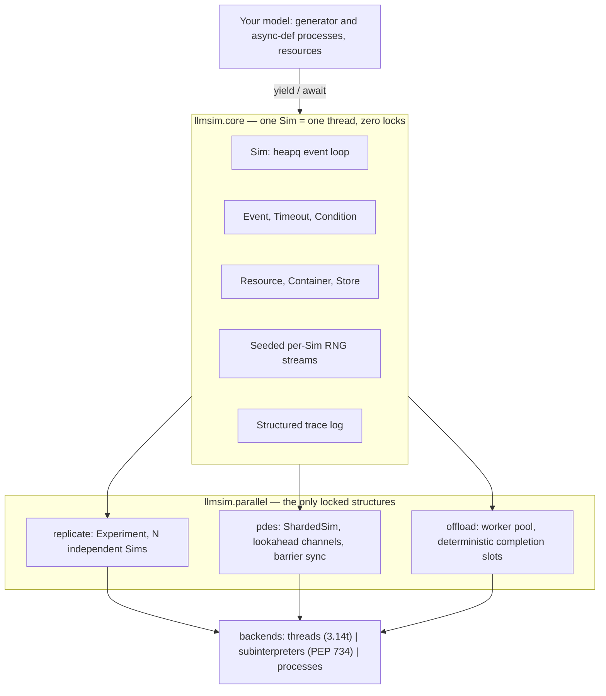
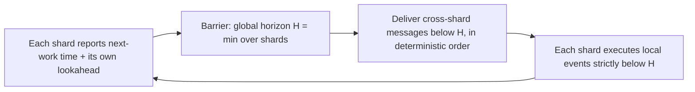

Discrete-event simulation has an odd relationship with parallelism. A study
may contain thousands of independent replications, an almost comically
parallel workload, yet the model inside each replication is often built around
a deliberately sequential event loop. Make the outside parallel and seeding,
serialization, and reproducibility become awkward. Make the inside parallel
and causality becomes the problem.

[llmsim](https://github.com/nobelk/llmsim) is a parallel discrete-event
simulation (DES) library for Python 3.14 and later. It keeps the
generator-as-process model that SimPy established and builds a typed,
`__slots__`-based core around a share-nothing rule: each event loop owns its
state, and parallel components communicate only at explicit boundaries. The
core and all three parallelism tiers are implemented and gated by determinism
tests in CI as the project approaches its 1.0 release.

Despite the name, the core library has nothing to do with calling LLMs. The name reflects two bookends: one of the two examples simulates an LLM-serving agentic workload, and the post-1.0 roadmap adds LLM-powered scenario *generation* — strictly at design time, never inside a running simulation.

<!--more-->

## The problem

DES is how engineers answer capacity and reliability questions about factories, fleets, queues, and networks before building them. Python's dominant DES library, SimPy, is sequential by design. Stochastic studies are embarrassingly parallel in theory — thousands of independent Monte Carlo replications — yet in practice most studies run on one core, or behind hand-rolled multiprocessing harnesses that give up unified seeding and reproducibility.

Python 3.14 changed the landscape: free-threaded CPython (PEP 703/779) removes the GIL, and subinterpreters (PEP 734) get a stdlib API. llmsim is a bet on that shift, with a deliberately narrow contract: **run stochastic studies several times faster on the hardware you already own, with bit-reproducible results, without leaving pure Python.** One caveat up front: my own measurements below show that free-threading, the era's headline feature, does not yet pay off for this workload — and measuring exactly why produced the most interesting result in this post.

## Share-nothing by construction

The central invariant is thread ownership: a `Sim` — the event loop — and every object attached to it belong to exactly one thread. The sequential hot path contains zero locks on every build; the only locked structures in the library are the channels in `llmsim.parallel` that carry cross-simulation traffic.



A model looks the way SimPy users expect — processes are generators, resources keep request/release semantics:

```python
import llmsim

def customer(sim: llmsim.Sim, bank: llmsim.Resource, service_time: float):
    with bank.request() as req:
        yield req
        yield sim.delay(service_time)

sim = llmsim.Sim()
bank = llmsim.Resource(sim, capacity=2)
sim.spawn(customer, bank, service_time=5.0)
sim.run(until=100.0)
```

On top of that core sit three parallelism tiers, ordered by how often users need them, plus the guarantee that underpins all three:

1. **Parallel replications** (the flagship): `Experiment.run(backend="auto")` fans N independent replications across cores — free-threaded threads on 3.14t, subinterpreters or processes on GIL builds — behind one backend abstraction. Work is always submitted as (importable callable, seed spec, config), never as live objects, so all three backends share a single code path.
2. **Single-run conservative PDES**: parallel discrete-event simulation partitions one large model into shards, one event loop per core. The synchronization is *conservative* — a shard never executes an event until it is provably safe — using a barrier safe-window protocol (from the YAWNS family) driven by model-provided *lookahead*: the minimum simulated-time delay any cross-shard message must incur. `pdes.analyze()` estimates the achievable speedup from a sequential trace *before* you invest in partitioning.
3. **In-run compute offload**: `yield sim.offload(fn, ...)` sends CPU-heavy event handlers to a worker pool, with deterministic completion slots by default.
4. **Reproducible randomness throughout**: a master-seed tree derives an independent RNG stream for every (config, replication) pair, each seeded by a 128-bit child seed obtained from SHA-256 path hashing.

The design also states its non-goals up front. Optimistic (Time Warp) synchronization is rejected as a non-goal for a concrete mechanical reason: CPython cannot snapshot or pickle a live generator frame, so rollback would impose state-saving obligations on user model code — a cost at odds with the SimPy-style ergonomics the library exists to preserve. There is no automatic parallelization of unpartitioned models, and no SimPy API-compatibility shim; a concept-mapping migration guide is provided instead.

## Determinism as a correctness requirement

The most consequential engineering decision is treating reproducibility not as a feature but as the definition of correctness: the same (master seed, config, replication) must produce identical results on any backend, any worker count, any build. A parallel result that differs from the sequential reference is classified as the worst bug in the system, because it silently invalidates the science built on top.

That principle turns into concrete machinery:

- Every parallel feature ships a same-seed-same-result test in the same pull request that introduces it.
- The PDES tier is gated by **bitwise trace equivalence**: a sharded grid-conveyor model must produce a trace identical to the sequential reference across 1, 2, 4, and 8 shards, including an adversarial model that places messages exactly on the synchronization horizon to attack tie-breaking.
- Cross-shard message delivery is ordered by `(timestamp, channel id, sequence)`, and offload results are applied at deterministic completion slots — never in completion order.
- No ordering anywhere may depend on wall-clock time or thread scheduling.

The PDES synchronizer runs barrier-based rounds. Each shard reports its next-work time — its next local event or earliest undelivered inbound message — plus its own outgoing lookahead, and the minimum across shards becomes the global horizon *H*. Cross-shard messages below *H* are then delivered in deterministic order, and only after delivery does each shard execute its local events strictly below *H*.



## Performance, including the bad news

The specs make a normative rule of it: no speedup claim without a measurement, and every slowdown regime documented next to the feature that has it. Here is what that produced on a 10-core machine (4 performance + 6 efficiency cores).

The process backend reaches about 3.7× replication throughput — roughly 80–90% of what an embarrassingly parallel pure-CPU baseline achieves on the same asymmetric cores. Subinterpreters reach about 4.3× at 8 workers on the GIL build, and offload achieves about 2.7× with six-way overlap. The roadmap's ≥6×-on-8-cores figure is consistent with the measured per-core efficiencies, but it remains a target, not a result.

The most interesting finding is negative. On CPython 3.14.2t, the free-threaded *thread* backend anti-scales for DES event loops: 1.33× at 2 workers, degrading to 0.98× at 8, because reference-count cache-line contention on objects every thread shares (module-level C functions, `random.py` globals, code-object constants) outweighs the parallelism. An isolated probe makes the mechanism unambiguous: a loop through pure-Python `Random.expovariate` scales at 0.37× across 8 threads, while the same math with thread-locally bound functions and constants scales at 3.54×. That is an interpreter-level ceiling, not a library defect. The library documents it, keeps the thread backend correct, and lets `backend="auto"` route around it; the same ceiling currently caps thread-based PDES at about 1.1×.

## Building from a durable specification

llmsim is also an experiment in process: the library was built with Claude Code using the spec-driven development workflow I described in [an earlier post](). The repository encodes an explicit document hierarchy: a full design document (`docs/part-deux.md`) at the top, from which `specs/mission.md` (vision, scope, non-goals), `specs/tech-stack.md` (normative technical constraints, where violating one is a bug, not a style issue), and `specs/roadmap.md` (Phases 0–6 broken into small, independently shippable steps) derive. When documents conflict, `specs/` wins over the README, and design changes must land in `specs/`, never just in code.

Each roadmap step is sized to one feature spec — `plan.md`, `requirements.md`, `validation.md` — living in `specs/<branch-name>/` and built on its own branch. The discipline compounds: every parallel feature must ship its determinism test in the same PR, every performance claim must arrive with its measurement, and the agent inherits those rules from `CLAUDE.md` on every session. The quality gates are strict throughout: `mypy --strict` *and* pyright must both pass, and ruff enforces PEP 8. CI runs a `{3.14, 3.14t, 3.15-dev} × {Linux, macOS}` matrix with both GIL settings on 3.14t, and pytest-benchmark regression thresholds have been enforced since Phase 0. The spec hierarchy, not the chat transcript, is the durable record of why the system is shaped the way it is.

## The example gallery

Two end-to-end examples run in CI on both GIL and free-threaded builds, and served as the API dogfooding pass before freezing the 1.0 API.

**Autonomous ride-hailing fleet.** A robotaxi fleet serves Poisson trip requests over a ring of city zones. Each vehicle is a generator process running its full lifecycle — idle, drive to pickup, carry, drop off, reposition, recharge. Charging stations are finite-capacity `Resource`s, idle vehicles wait in a `FilterStore`, and a pluggable dispatch policy (closest-available or power-of-d) ranks candidates; requests abandon after a patience window. One subtle geometry decision does double duty: inter-zone travel times are fixed with a strictly positive minimum, and that minimum is exactly the channel lookahead the zone-sharded PDES variant needs — continuous coordinates would have given adjacent points near-zero lookahead and no feasible sharding. The example includes a fleet-sizing Monte Carlo study (confidence intervals over fleet size × demand via `Experiment`) and a sharded variant that is trace-equivalent to the sequential model.

**LLM agentic workflow.** A simulation *of* an LLM-serving system, in the shape current LLM-scheduling research studies: tasks arrive at an orchestrator, and each becomes an agent process alternating think steps (inference requests queued at shared, batching LLM-server `Resource`s with token-length-dependent service times) and act steps (tool calls with stochastic latency, failures, and bounded retries). KPIs are end-to-end task latency, queue depth, and cost per task. There is never a real LLM or network call inside a run; that rule is enforced by a test. The example includes a capacity-planning sweep (server count × batch size × agent concurrency) and an offload showcase where a CPU-heavy scoring policy runs on the worker pool in strict mode, verified by the same trace-equivalence machinery.

## What comes next

The remaining pre-1.0 work is tagging and publishing to PyPI. After that, the roadmap's Phase 6 adds LLM-powered scenario generation: a `ScenarioAgent` that reads system documents — hardware specifications, operating procedures, failure-mode reports — and proposes grounded fault-injection scenarios, such as degraded charge rates during a heat wave or cascading queue collapse after a dual-station outage. Scenarios are emitted as validated, content-hashed artifacts that simulations replay deterministically. Every generated scenario must cite the source passage that motivates it, and CI replays recorded fixtures rather than touching the network. The determinism boundary stays absolute: the LLM works at design time; the simulation remains a pure function of seed and config.

The code, specifications, and performance notes are public at
[github.com/nobelk/llmsim](https://github.com/nobelk/llmsim), with full
documentation at [outloop.blog/llmsim](https://outloop.blog/llmsim/). The most
important result so far is not a speedup figure. It is that every backend must
produce the same simulation before any of them is entitled to be called fast.
