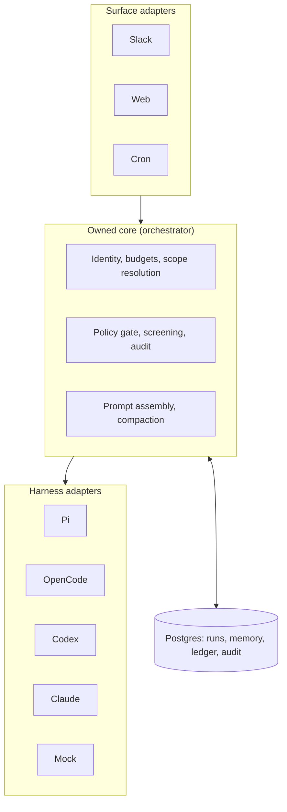
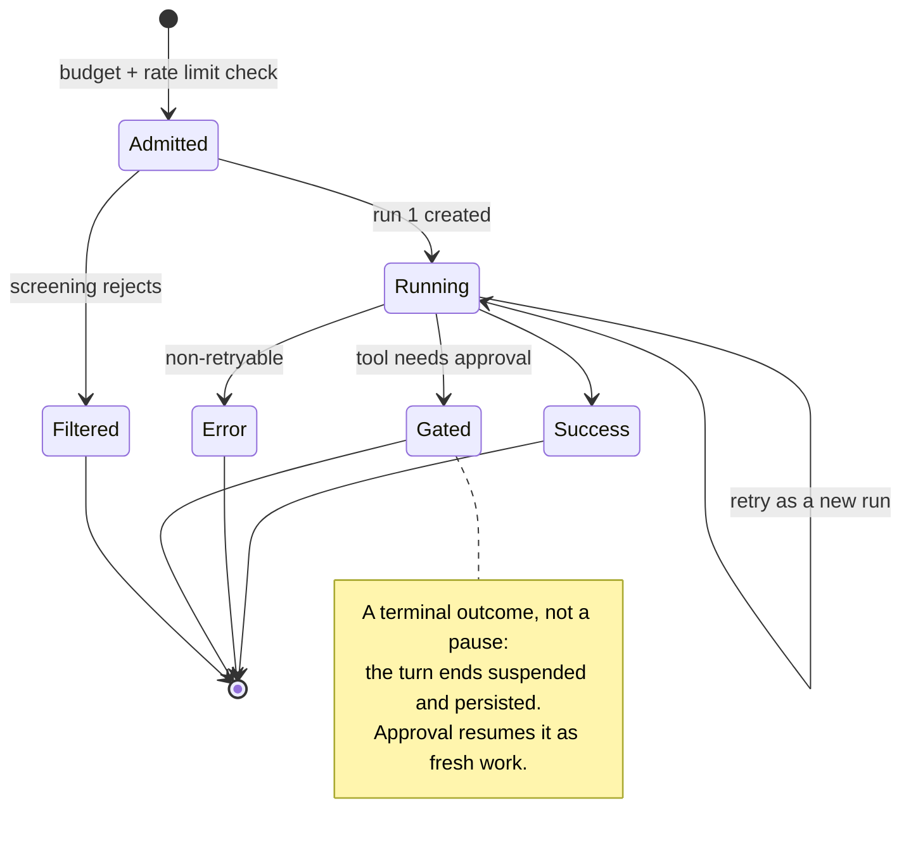

Writing about agents tends to be writing about prompts. Far less of it is about the **harness** — the code that sits between a user and a model loop and decides who may run what, on whose budget, against which files, with what recorded afterward. That code is where agentic systems actually succeed or fail in production.

[yc-software/qm](https://github.com/yc-software/qm) is an unusually legible example: a headless TypeScript core (Fastify + Postgres) that drives interchangeable agent runtimes — Pi, OpenCode, Codex, Claude — across Slack, a web app, and cron, with per-scope isolated sandboxes, memory, and credentials. It is a dense catalog of production patterns. Below are ten I found transferable to any agentic system, including single-user CLI agents.

<!--more-->

---

## The Shape of a Harness

Before the patterns, the layering they assume. Surface adapters normalize UIs, harness adapters normalize model runtimes, and a small owned core sits in the middle holding everything the business actually cares about.

The rule the diagram encodes: **adapters at both ends, a small testable core in the middle.**

---

## 1. Own a Thin, Vendor-Neutral Turn Pipeline

qm's orchestrator owns identity, rate limits, budgets, scope resolution, security screening, prompt assembly, and compaction — then delegates the model-and-tool loop to a `Harness` interface. Four vendor loops run behind one contract.

The split matters because the two halves have different half-lives. Authorization, spend controls, audit, and memory are yours for years. The planning loop is a vendor's, and may well need replacing on their schedule rather than yours. Put everything in the first category in code you own and test once, and the second category becomes swappable without touching it.

## 2. Separate the Turn from the Run, and Name Every Outcome

A qm turn — one logical interaction — ends in one of four named outcomes: **Success**, **Error**, **Gated** (suspended, awaiting human approval), or **Filtered** (rejected by security screening). Each execution attempt within a turn is a **run**, persisted separately in a `RunStore`.

Note that **Gated is a terminal outcome, not a blocked thread**. The turn ends; the pending approval is a durable record; granting it resumes the work later. That is precisely what an in-memory `prompt()` cannot survive a restart to do.

The turn/run split does the other half of the job: each retry gets its own record while the user-facing interaction keeps one ID, so audit and crash recovery have stable identities to hang off. Even a single-user CLI agent benefits — "awaiting approval" and "rejected by policy" deserve distinct, recorded outcomes, not a shared nonzero exit code.

## 3. Enforce Policy in a Deterministic Gate, Not in the Prompt

Every side-effecting qm tool call passes `evaluateCommandWithLayer` before execution. The gate returns three outcomes — **allow**, **require_approval**, **deny** — and the latter two are typed errors carrying the command, the reason, and the matched rule. Approval requirements live as metadata on the tool definition, read by the orchestrator rather than described to the model.

The model cannot talk its way past dispatch code. It can talk its way past a system prompt, and over a long enough interaction something eventually does. The corollary pattern is how you write the resulting error: qm's tool errors are actionable prose addressed to the model, naming the correct alternative ("use the memory tool instead"). Tool results _are_ prompts, and an error that names the fix converts a failure into a recovery step instead of a retry loop.

## 4. Own the Canonical Transcript; Rebuild Provider Context Per Turn

qm stores typed session entries in its own schema _plus_ verbatim provider "tape" records, then replays them into whichever harness runs the next turn. That buys mid-conversation model switching, redaction by audience, and replay debugging. Never let a vendor SDK's in-memory session be the only copy of the conversation.

Owning the transcript is also what makes the two hard parts safe. Compaction runs at two thresholds — `COMPACT_SOFT_FRACTION = 0.7` (background summarization) and `COMPACT_HARD_FRACTION = 0.9` (inline), with deterministic truncation as the floor — so compaction can degrade but never take a turn down. And it never splits a `tool_call` from its `tool_result`. After a crash, qm injects a synthetic tool result into the rebuilt context: `[interrupted — check what actually happened before redoing anything with side effects]`. One string, and double-executed side effects stop being a restart hazard.

## 5. One Isolation Unit, and Legible State Inside It

qm has a single tenancy primitive, `ScopeId`, and it partitions memory, filesystem, sandbox, keychain, egress policy, and ACLs **identically**. Not six similar-looking schemes — one.

What sits inside a scope is then held to the same standard. Memory is a bounded, human-readable artifact: a markdown notebook capped at 300 dated facts, one per bullet, each tagged with the turn that produced it, validated by a grammar parser. Plain text is auditable, diffable, and correctable in a way opaque vectors are not; embeddings are an acceleration, never the source of truth. And mutations arrive as numbered `UPDATE` / `DELETE` / `ADD` actions applied deterministically, so a garbled model response corrupts one line rather than the notebook.

One well-chosen isolation unit removes an entire class of cross-context leakage bugs — the class you otherwise discover in an incident review.

## 6. Make Retries Idempotent with a Tool Ledger

qm journals every side-effecting tool call keyed by `(run, attempt, callIndex)` and returns the cached result on retry, with success-only caching predicates.

This is the pattern most systems skip and most regret. The moment you add automatic retry to a turn, you have built a machine that re-runs shell commands and re-sends messages. A ledger is the difference between "retry the turn" being safe and being a production incident.

## 7. Ship a Mock Harness as a Peer of the Real Ones

qm's `mock` harness implements the full `Harness` contract and is whitelisted for every provider. Hundreds of deterministic tests drive the entire orchestrator — approvals, screening, read-only mode — without ever calling a model.

This is the single highest-leverage test asset in an agentic system, and it only exists if the harness boundary from pattern 1 is real. Above it sits an eval pyramid: deterministic behavior tests, live smoke tests against each real substrate, and LLM-judged quality benchmarks gated on regression floors. A floor-gated judged benchmark converts subjective quality into a number that can only regress loudly.

## 8. Make Token Economics a Measured Number, Not a Hope

Two levers, both of which only work if you instrument them.

The first is the prompt-cache boundary. qm builds its system prompt stable-content-first, records `stableSystemBytes` before appending time-varying blocks (clock, rosters), and splits the cache boundary exactly there. Per-turn `cacheRead` and `cacheWrite` are persisted to an operator-visible store. Caching only pays if you order content by volatility deliberately _and_ verify the hits actually happen.

The second is model routing. Most LLM calls in an agent platform are not the agent loop — summarization, judging, titling, screening, and compaction all are, and all run against cheaper models by default, derived from the base model with per-job overrides. That reserves the expensive model for the work users see. It is not free, though: degrade the screening or compaction model far enough and the main loop feels it indirectly, which is exactly why auxiliary quality belongs in the eval pyramid from pattern 7.

## 9. Constrain Where Autonomous Output May Be Delivered

qm's cron jobs carry predeclared destination keys, limited to authenticated destinations of the conversation that created them. A scheduled agent cannot invent a recipient.

Scheduled and event-driven turns are where agentic systems become spam vectors or exfiltration paths, because no human is in the loop at send time. The related discipline is **wake routing**: when an async event hits a session in an unknown state, decide explicitly whether to engage, steer the running turn, or drop it. "Always start a new run" is how you get duplicated work.

## 10. Declare Variation Instead of Hard-Coding It

Runtimes differ, and organizations differ. Both kinds of variation are better declared than branched on.

For runtimes, qm's `HarnessAdapterProfile` declares each adapter's transports and capability set — abort, steer, images, thinking level — so the core degrades per-harness instead of pretending all runtimes are equal. The contract is turn-shaped: messages and tools in; a message, a tool call, or an error out. Malformed model output is a normal outcome variant, not an exception. Refusals and provider errors get a budgeted fallback — check remaining wall clock, swap the session model, repair the transcript, re-prompt with an explanatory note.

For organizations, customization is **data, not code**: org-specific tools, skills, and command rules flow through a size-capped deployment layer, with skills as markdown packs materialized into the agent's filesystem on demand rather than stuffed into every prompt. Neither kind of variation should require editing the core to accommodate it.

---

## What the Ten Have in Common

| Pattern | The thing it refuses to trust |
| --- | --- |
| 1. Thin vendor-neutral core | A vendor's roadmap |
| 2. Turn / run + named outcomes | Process memory, and one ID for every attempt |
| 3. Deterministic policy gate | The prompt as an enforcement layer |
| 4. Own the transcript | The SDK's session object as the only copy |
| 5. One isolation unit, legible state | Ad-hoc per-subsystem tenancy, and opaque memory |
| 6. Tool ledger | That a retry is free |
| 7. Mock harness + eval floors | Live models as the only behavioral oracle |
| 8. Measured token economics | Assumed cache hits, and free auxiliary calls |
| 9. Constrained delivery | Unattended good judgment |
| 10. Declared variation | Runtime parity, and per-org forks of the core |

Read down the right column and the thesis is visible: **deterministic guardrails outrank prompt guardrails, and durability is the architecture.** Policy gates, capability declarations, ledgers, and isolation boundaries live in dispatch code the model cannot influence. Turns, runs, approvals, schedules, and audit records live in a database that survives a deploy. Prompts are the last layer, not the first.

That framing also explains where qm _doesn't_ spend its complexity. It gets its multi-agent value from narrow specialized passes — a memory-consolidation agent, cheap should-I-respond judges, scheduled turns — behind strong isolation and audited bridges, rather than from orchestrated agent-to-agent fan-out. For assistant workloads, that trade holds up better than a team of agents negotiating with each other.

> The hard part of an agentic system was never the loop. It is everything the loop is allowed to touch.
