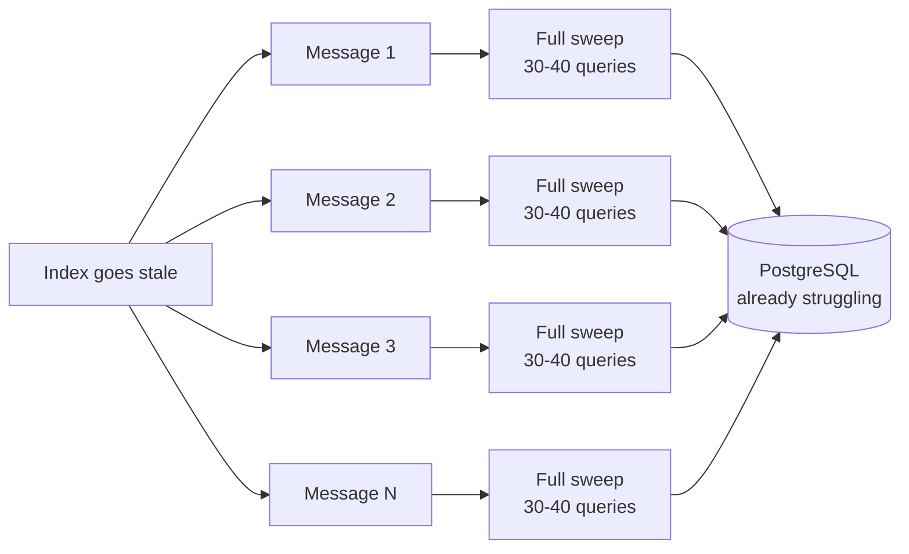
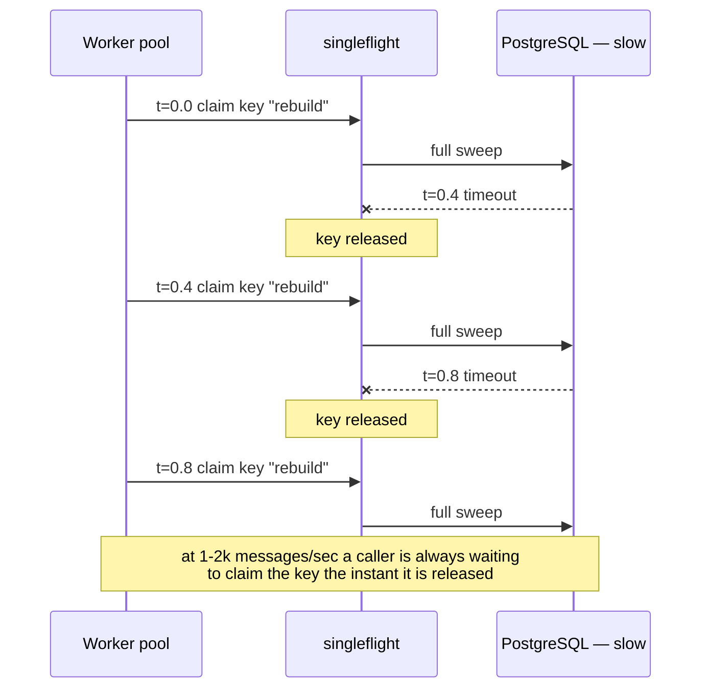
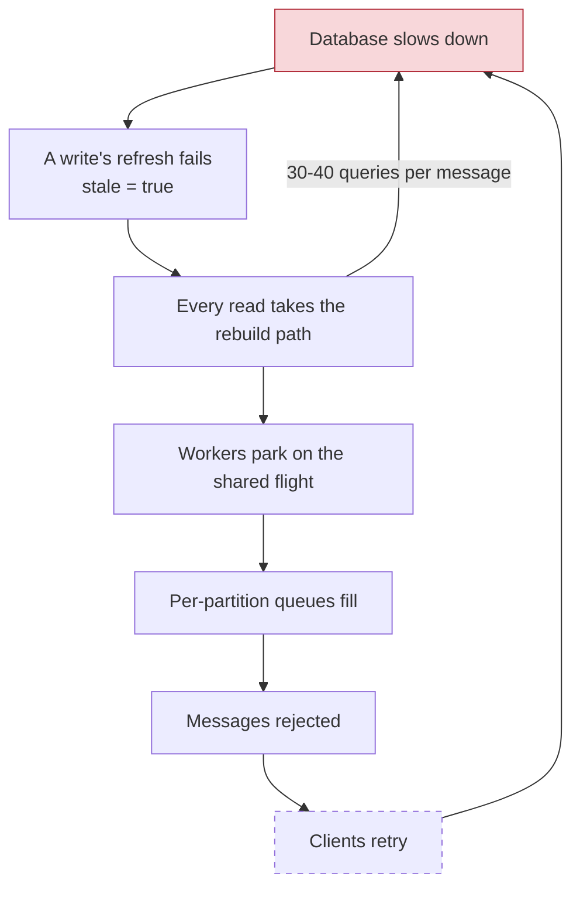
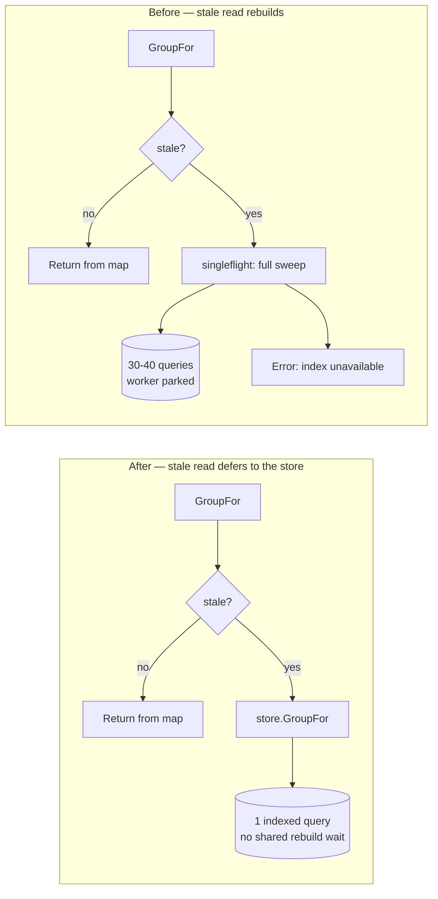
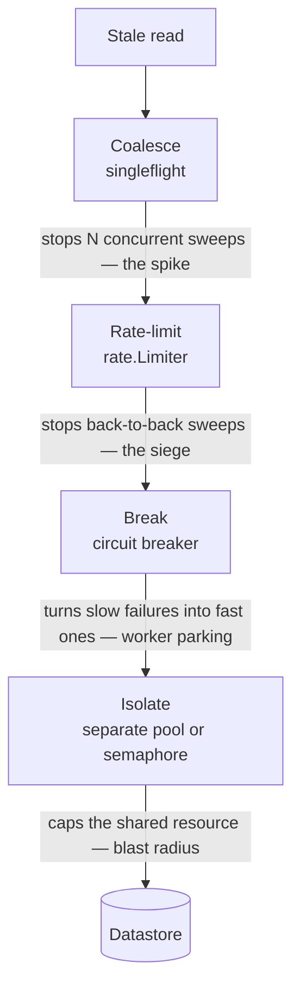

A design review named the hazard. The specification measured the hot path to
the nanosecond. Test coverage reached 97.7 per cent, and the mutation score was
0.92. None of those facts prevented a read-through cache from containing the
outline of a database outage.

The defect was caught on a feature branch and never merged. It is worth
examining because the first review found exactly half the problem. Its remedy
removed a concurrent query spike and replaced it with a serial, unending one:
a thundering herd became a siege.

<!--more-->

---

## The short version

A read-through index in front of PostgreSQL would have turned a brief database slowdown into a self-sustaining query flood. Three properties make this class nasty:

1. It only appears when the database is **already** unhealthy.
2. It **amplifies** with load, so the busiest systems fail hardest.
3. `singleflight` — the standard Go answer to this problem — was already in place and did **not** prevent it.

The fix was to delete code, not add it.

---

## The setup

A hot ingestion path needed to answer a cheap question on every inbound message: *which group does this device belong to?*

The answer lives in PostgreSQL, behind a unique index, so it's a single-row point lookup. But "cheap" is relative. At the design envelope — five hundred devices each reporting two to four times a second — that's one to two thousand queries a second, for an answer that changes only when an operator reconfigures something: a handful of times per week.

So: cache it. The design was deliberately conservative. No TTL, because entries vanishing on a timer would be unsafe here. Instead an in-memory index, built at start-up and refreshed by the writes themselves, with a `stale` flag for when a refresh fails.

```go
// Store is the datastore behind the index.
type Store interface {
    GroupFor(ctx context.Context, device DeviceID) (GroupID, bool, error) // one indexed row
    Groups(ctx context.Context) ([]GroupID, error)                        // enumeration, for rebuild
    Members(ctx context.Context, group GroupID) ([]DeviceID, error)
}

type Index struct {
    store    Store
    mu       sync.RWMutex
    byDevice map[DeviceID]GroupID
    stale    bool // set when a refresh fails
}
```

The read path looked reasonable:

```go
func (ix *Index) GroupFor(ctx context.Context, device DeviceID) (GroupID, bool, error) {
    ix.mu.RLock()
    stale := ix.stale
    group, ok := ix.byDevice[device]
    ix.mu.RUnlock()

    if !stale {
        return group, ok, nil // fast path: pure memory
    }
    // The index can't be trusted. Rebuild it, then answer.
    if err := ix.rebuild(ctx); err != nil {
        return "", false, fmt.Errorf("index unavailable: %w", err)
    }
    // ... re-read under the lock and return
}
```

`rebuild` does what you'd expect: one query to enumerate every group, then one query per group to load its membership, then replace the map. Call it 30–40 queries on a system with a few dozen groups. Trivial once a week. Ruinous once per message.

One more link completes the circuit: `stale` is set by a *write* whose refresh failed. So a single failed write against a slow database flips the flag — and from that moment, every *read* takes the rebuild path until a rebuild succeeds.

Read that again. It's the bug.

---

## The anatomy of a cache stampede

A **cache stampede** (also *thundering herd*) is what happens when a cache miss is expensive and many callers miss at once. Instead of one expensive operation you get N, precisely when the expensive thing is least able to cope.



The textbook fix is request coalescing: let one caller do the work and have the rest wait for its result. In Go that's `golang.org/x/sync/singleflight`.

The API is one call. You hand it a key and a function. The first caller with that key runs the function; every caller arriving *while it is still running* blocks and receives that same result without doing the work itself. The moment the function returns, the key is forgotten.

That last sentence is the whole article.

```go
result := ix.flight.DoChan("rebuild", func() (any, error) {
    return nil, ix.rebuild(ctx)
})
select {
case <-ctx.Done():
    return "", false, ctx.Err()
case r := <-result:
    if r.Err != nil {
        return "", false, fmt.Errorf("index unavailable: %w", r.Err)
    }
}
// ... re-read under the lock and return
```

So we added it. This was not the original design: a review pass had already flagged that a stale index has every reader rebuild at once, and `singleflight` was the fix for *that*. The commit was titled "Stop every reader rebuilding the index at once when it goes stale." The concurrent stampede was real, and it was removed.

The sequential one arrived in the same commit, unnoticed — because once a named hazard has a named answer, nobody re-asks the question.

---

## Why `singleflight` was not enough

`singleflight` deduplicates **concurrent** calls. It does not deduplicate **sequential** ones — because a key exists only for the duration of one flight. When the flight completes the key is deleted (`singleflight.go`: `delete(g.m, key)`), so the next caller starts a brand new flight. That is correct, documented behaviour. It is a deduplicator, not a rate limiter.

Now consider a datastore that is *persistently* slow rather than momentarily busy. The `stale` flag never clears, because every rebuild fails or times out:



Instead of N concurrent sweeps you get back-to-back sweeps for as long as the fault lasts:

| | Without singleflight | With singleflight |
| --- | --- | --- |
| Peak query rate | Up to N concurrent sweeps | At most 1 sweep at a time |
| Sustained query rate | Potentially many overlapping sweeps | Back-to-back sweeps while callers continue |
| Duration | Until callers stop or the database recovers | Until callers stop or the database recovers |
| Self-healing | No | No |

The peak is lower, which is valuable, but no recovery interval exists between
attempts. Under steady traffic, the system does nothing to help the database
climb out. We replaced a spike with a siege.

`singleflight` did exactly what it promises. We had asked it to solve a problem it doesn't solve.

---

## The blast radius

Three properties turned a bad query pattern into an outage amplifier.

**1. It blocked the message-handling goroutine.** The rebuild was awaited synchronously from the handler, which runs on a bounded worker pool with per-partition queues. (`DoChan` runs the work on its own goroutine, but the handler still parks waiting for it — same effect.) A parked worker isn't handling messages. Its queue fills, and once full, further messages are rejected rather than queued.

**2. Every worker parked on the same flight.** The key was a single constant — `const rebuildKey = "rebuild"`, with a comment noting "the index is rebuilt whole, so there is only ever one." True, and it means one slow rebuild stalls *every* worker simultaneously: a perfectly correlated failure across a pool designed to be independent. `singleflight` did make this gentler on the *database* — one sweep instead of N — but it did nothing for the *pool*. Correlated parking is correlated parking either way.

**3. The only bound was the message deadline.** The rebuild inherited the caller's context, whose budget was a generous outer bound on handling one message — sized for the pathological case, not the typical one. Nothing said "a rebuild should take at most X."

Put together, those three close a loop:



The system's answer to a slow database is to generate more database load. That positive feedback is why this class takes systems down rather than degrading them.

Our transport happens to be unpaired fire-and-forget with no retry budget, and its busy-rejections are rate-limited precisely so a saturated partition cannot amplify outbound traffic — the dashed box in the diagram. So we would have been spared the last hop. Plenty of systems aren't, and if yours acknowledges or retries, that hop is where a bad afternoon becomes an outage.

---

## Why this bug hides in production

Most bugs are worst when you're watching. This one is worst when you aren't.

- **It is invisible in healthy operation.** The stale path never executes. Staging won't show it. Load tests won't show it, unless you load-test *with a degraded database*, which almost nobody does.
- **It fires during an incident.** The trigger is your datastore already being unhappy. It arrives mid-incident and makes the thing you're recovering harder to recover.
- **It looks like the database is the problem.** Dashboards show a query flood from the application. The obvious reading — "something is hammering the DB" — is correct but backwards: the flood is a *symptom* of the DB being slow, not the cause. You can tune the database for an hour without touching the thing actually generating the load.
- **It resists the obvious mitigation.** Restarting clears the flag and looks like a fix, so the root cause gets filed as "transient" — and it comes back the next time the database hiccups.

---

## The fix

The shipped fix removes code:

```go
func (ix *Index) GroupFor(ctx context.Context, device DeviceID) (GroupID, bool, error) {
    ix.mu.RLock()
    stale := ix.stale
    group, ok := ix.byDevice[device]
    ix.mu.RUnlock()

    if stale {
        // Can't trust the index: ask the source of truth. One indexed point
        // lookup, no sweep, no shared flight, no pile-up.
        return ix.store.GroupFor(ctx, device)
    }
    return group, ok, nil
}
```



Two properties make this the right shape:

- **The fallback is cheap and bounded.** One indexed lookup per message — exactly the load the system would have had without the cache.
- **The expensive work left the hot path entirely.** The index is rebuilt on the next write, which is operator-paced, not message-paced.

`singleflight`, the generation counter guarding the rebuild, and the "index unavailable" error all existed *only* to support rebuilding on the read path. When that went, they went with it.

---

## When refresh must remain on the read path

Sometimes there's no cheap fallback. Then you need three things `singleflight` alone won't give you.

**Detach and bound the work.** Never let shared work inherit one caller's deadline, and never let it run unbounded:

```go
func (ix *Index) refreshOnce(caller context.Context) error {
    // Detach from whichever caller arrived first, then apply a budget sized for
    // a rebuild rather than for handling one message.
    ctx, cancel := context.WithTimeout(context.WithoutCancel(caller), rebuildBudget)
    defer cancel()
    return ix.rebuild(ctx)
}
```

`singleflight` has no opinion about contexts — the function it runs takes none. The coupling comes entirely from the closure: whichever caller happens to *start* the flight is the one whose `ctx` the shared work captures. Without `WithoutCancel`, that caller giving up cancels the rebuild for every healthy waiter behind it. But detached is not the same as uncancellable: re-attach to the owning component's lifetime context so shutdown still stops it.

**Rate-limit the attempts.** This is what stops the sequential storm. `golang.org/x/time/rate` is the least code:

```go
// rate.NewLimiter(rate.Every(time.Second), 1) — at most one rebuild per second
if !ix.refreshes.Allow() {
    // Inside the cool-down: fail fast rather than queue behind a rebuild.
    return "", false, ErrIndexUnavailable
}
```

`Allow()` is non-blocking, which matters: `Wait()` would reintroduce the parking problem it's meant to solve. (`ErrIndexUnavailable` is the sentinel our shipped fix deleted. On this path it comes back, because on this path there *is* no cheap answer to fall back to.)

**Fail fast while the dependency is down.** A circuit breaker turns repeated slow failures into immediate ones, which is what protects the worker pool. It only works *on top of* the timeout above: a breaker counts errors, so something has to convert "slow" into "failed" before it can ever trip. In `github.com/sony/gobreaker/v2`, for instance, the `Timeout` setting is how long the breaker stays open, not a per-call deadline. (v2 is the generic API; v1 is otherwise similar but returns `interface{}`.)

**Bulkhead, but know what you are buying.** `database/sql`'s `SetMaxOpenConns` is a single global cap on one `*sql.DB`, with no notion of subsystems — and a caller that cannot get a connection *blocks* until one frees or its context expires, which is the worker-parking failure mode all over again. Real per-subsystem isolation means a separate pool per subsystem, or a semaphore in front of the shared one.

Layered, each covers a case the previous one doesn't:



Reaching for only the first layer is the mistake we made.

---

## Testing the cost of failure

The test that catches this is not a correctness test. It counts calls.

Put a fake store behind the index that always fails and records every call. Mark the index stale, then issue N sequential reads and assert on the *call count*:

```go
store := &countingStore{err: errUnavailable}
ix := NewIndex(store)
ix.markStale()

for range 100 {
    _, _, _ = ix.GroupFor(ctx, deviceA) // errors are expected here
}

if got := store.Sweeps(); got > 1 {
    t.Fatalf("degraded store swept once per read: want<=1 got=%d", got)
}
```

The old code scores 100. The fixed code scores 0. A second variant — a store that is *slow* rather than failing — catches the other half: with a fake clock, assert no read blocks longer than the fallback's budget.

Neither test asserts anything about the returned answer. That is the point. **This is a class of bug that correctness assertions structurally cannot see** — which is exactly why coverage of 97.7% and a mutation score of 0.92 sailed straight past it. Mutation testing even found four genuine defects in this file. Every one of them was a correctness defect. The tooling worked perfectly and was pointed at the wrong axis.

---

## What to carry forward

1. `singleflight` deduplicates concurrent work. It is **not** a rate limiter, a circuit breaker, or a timeout. Those are four different tools, and you probably need more than one.
2. Never let shared, expensive work inherit a single caller's deadline — and detached is not the same as uncancellable.
3. The best degraded mode is usually **the behaviour the optimisation replaced**. Its cost is a number you already know. (Ours had never actually run in production, since the cache and the lookup it fronts landed together. It was still the right fallback, because one indexed lookup per message is a cost you can state without measuring.)
4. High coverage and high mutation scores show how thoroughly tests exercise
   stated behavior. They do not show whether the system is *survivable* under
   a degraded dependency.
5. A comment that names a hazard and stops is answer-shaped. The one on this field read: "flight collapses concurrent rebuilds into one." Every word true, and it says nothing about the world *with* the flight in place — but a reader asking "is the stampede handled?" finds a paragraph about stampedes and leaves satisfied. Say which cases a mitigation covers and which it doesn't, or point at the test that draws the line.

The through-line with the rest of this series: agents are good at following stated rules and bad at inventing questions nobody asked, which makes an unstated criterion an unusually reliable place for a bug to hide. Every cost measurement here ran against a healthy dependency, and every failure analysis asked only which direction to fail — never the price. The bug lived in the cell where those two axes should have crossed.

The missing question belonged in both the specification and the harness
instructions: **What does the failure path cost?**
