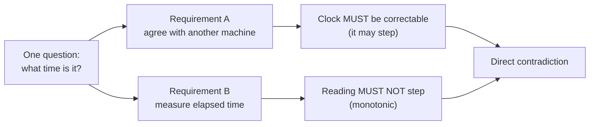
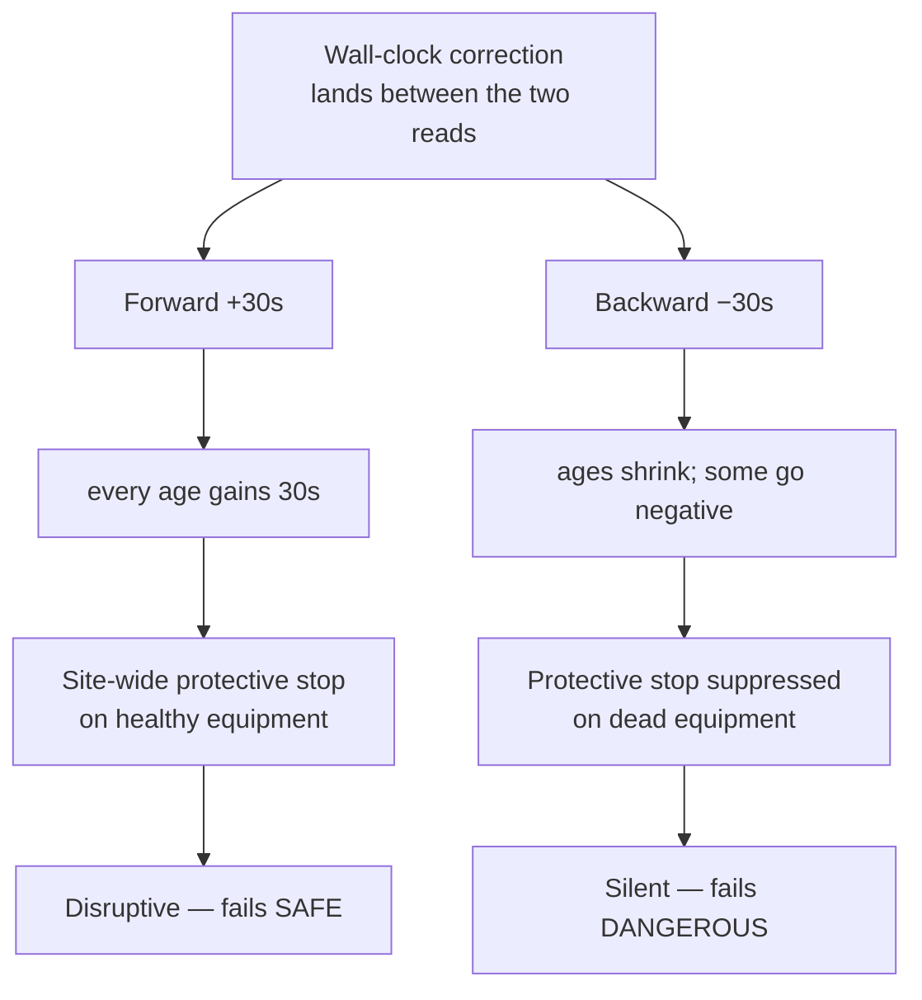
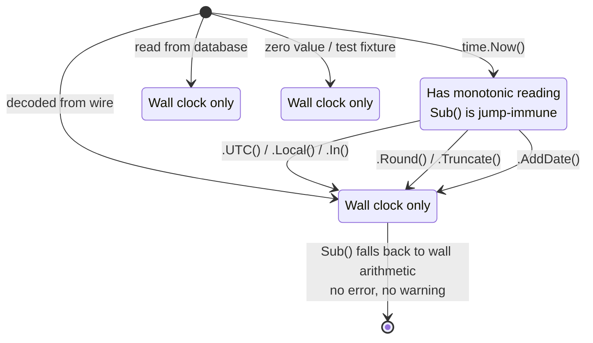
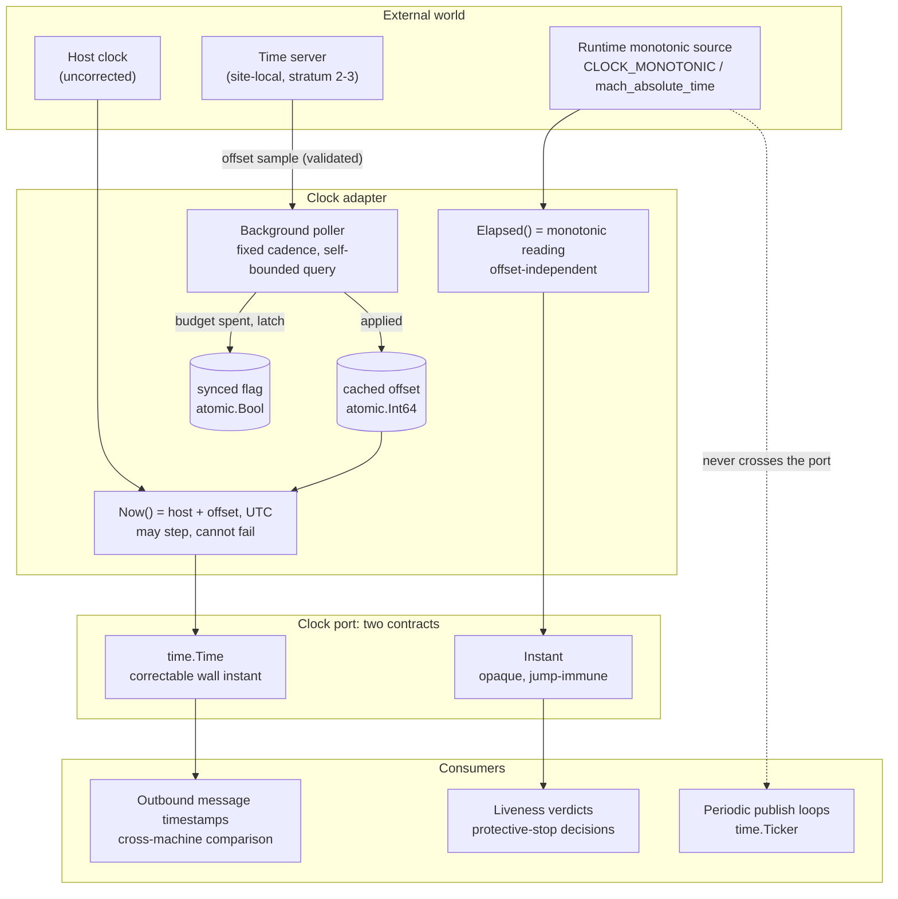
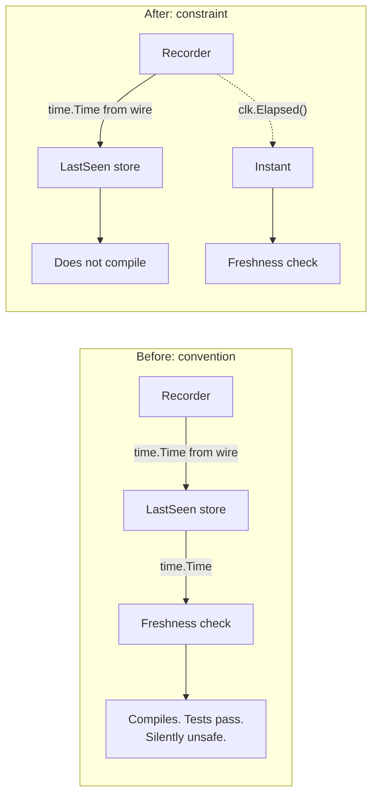
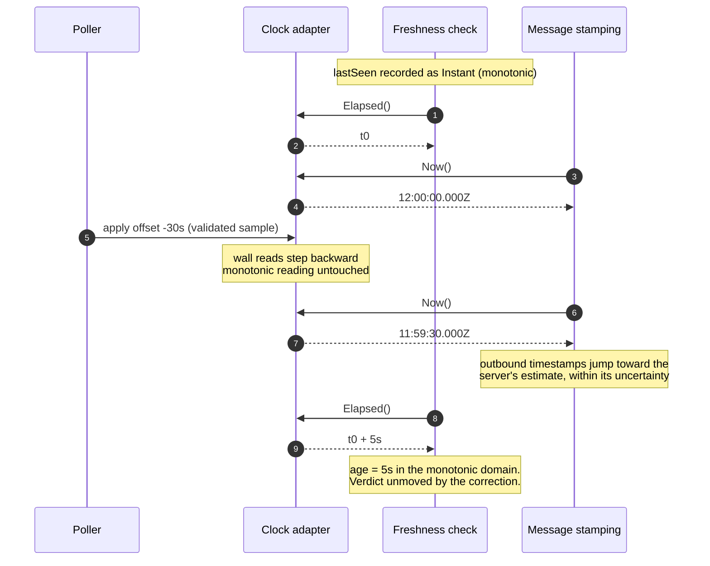
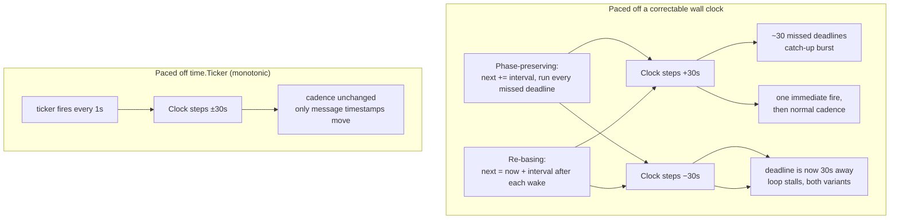

The previous part of this series was about a bug that every quality gate missed because nobody had asked the crossing question. This part is about the opposite move: taking a hazard that *was* named, and pushing it out of the documentation and into the type system, where neither a tired engineer nor a coding agent can step on it without the compiler objecting.

The subject is a Go service at the edge of a physical site, coordinating moving equipment. It does two unrelated things with time, and the two requirements are irreconcilable in a single `now()`.

<!--more-->

---

## TL;DR

A long-lived process needs a clock that can be **corrected** (so its outbound timestamps agree with other machines) and a measurement that can **never step** (so "have I heard from unit 7 in the last five seconds?" means what it says). One value cannot satisfy both contracts.

Go's `time.Time` carries a monotonic reading, which looks like the answer, but that protection **degrades silently** — a stray `.UTC()` or a timestamp decoded off the wire turns a safe subtraction into wall-clock arithmetic with no warning.

The fix was to split the port into two reads returning **two different types**, and to push the jump-immune type to where the values are *created*. The wrong comparison stopped compiling.

---

## The Two Requirements

The process does two things with time:

1. **It stamps outbound messages** with an instant that a different machine, across a network, compares against instants of its own. For those comparisons to mean anything, the two machines must agree on what time it is. This demands a clock aligned to an external authority — a clock that is **correctable**.

2. **It decides whether equipment is still responding.** "I last heard from unit 7 four seconds ago; my liveness window is five seconds; therefore unit 7 is live." This demands a **monotonic** measurement — one that only moves forward, at a rate close enough to real elapsed time that the threshold means what it says.

The first requirement forces the clock to move when an external authority says it is 300 ms fast. The second forbids exactly that: if the clock can step, the difference between two readings taken five seconds apart is not five seconds — it is five seconds plus however far the clock jumped in between.



These are not two views of one problem. A single value can *carry* both readings — `time.Time` does exactly that — but a single undifferentiated return type cannot *enforce* which one a caller gets, and enforcement is the whole requirement on a safety path.

---

## The Failure This Prevents

Make it concrete. The liveness rule is:

```text
live(unit)  ⟺  seen(unit)  ∧  now − lastSeen(unit) ≤ 5s
```

Suppose both `now` and `lastSeen` are wall-clock instants, and a correction lands between the two reads.

**A forward correction of 30 seconds.** Every `lastSeen` in the process was recorded before the jump; `now` is after it. Every unit's computed age gains 30 seconds at once, and every unit crosses the threshold in the same evaluation. The service concludes the entire site has gone silent and applies a protective stop to equipment that is moving normally, with no fault behind it. Disruptive, expensive, visibly wrong — but *safe*.

**A backward correction of 30 seconds.** The arithmetic runs the other way. A unit that genuinely stopped responding 20 seconds ago computes an age of **−10 seconds**. It looks fresher than fresh. The protective stop that should fire is suppressed, and the operator's display shows a healthy unit that is not there.



The two directions are not symmetric. The first is a false positive on the safe side. The second is a false negative on the dangerous side — and there is no subsequent check to catch it, because the check *is* the one that failed.

Note the trigger: **the correction is not a bug.** It is the clock doing exactly what it was built to do. The danger is not that time sync malfunctions; it is that time sync *works* while something else is subtracting two instants.

---

## Why the Language's Built-In Answer Is Not Enough

Since Go 1.9, `time.Time` carries a monotonic reading alongside the wall clock, and `Sub` prefers the monotonic one when both operands have it. On paper the standard library already solved this.

In practice the protection has a property that disqualifies it as a *safety* contract: **it degrades silently.** The monotonic reading is stripped by a list of ordinary operations — `UTC()`, `Local()`, `In()`, `Round()`, `Truncate()`, `AddDate()` — and it is absent entirely from any `time.Time` that did not come from `time.Now()`: a timestamp decoded off the wire, a value read back from a database, a zero value, a value built by a test. (`Add()` is the notable one that *preserves* it.)



When either operand lacks the reading, `Sub` returns a plausible `time.Duration`. Nothing fails. Nothing warns. The same expression that was safe yesterday is fail-dangerous today because someone upstream started returning a parsed timestamp instead of a clock read.

The trap is easy to spring by accident. A clock adapter that contractually returns UTC is written the obvious way:

```go
func (SystemClock) Now() time.Time { return time.Now().UTC() }
```

That `.UTC()` — added to satisfy a completely unrelated requirement about timezone consistency — strips the monotonic reading from every value the clock ever returns. Every downstream subtraction becomes wall-clock arithmetic, with no diagnostic at all.

This is the exact shape of change a coding agent makes cheerfully and correctly against the stated requirement, and it is why "correct until someone adds a method call" is not a strong enough guarantee for a path whose unsafe outcome is a suppressed protective stop.

---

## The Design: Two Reads, Two Types, One Port

Stop treating "what time is it" as one question. The port the application depends on carries **two reads with different contracts** and — critically — **different types**.

```go
// Clock is the consumer-defined port for time. It carries two reads because
// only one of them survives a correction.
type Clock interface {
    // Now is the wall instant in UTC: host clock plus the cached offset.
    // It MAY STEP in either direction when a correction is applied, so
    // subtracting two Now reads is not a valid elapsed-time measurement.
    Now() time.Time

    // Elapsed is the jump-immune reading. Its subtraction is the only
    // sanctioned elapsed-time measurement; no correction ever moves it.
    Elapsed() Instant
}
```

`Now()` is for anything that leaves the process or is compared against another machine's notion of time: message timestamps, audit records, anything a human reads. It is allowed to jump, because jumping is how it stays truthful. `Elapsed()` is for anything that asks "how long since" — a count of nanoseconds from an arbitrary origin fixed at process start.



### The Type Is the Enforcement

The load-bearing decision is that `Elapsed()` returns neither `time.Time` nor `time.Duration`. It returns a distinct opaque type:

```go
// Instant is a jump-immune elapsed-time reading: nanoseconds from an arbitrary
// origin fixed at process start. Only differences are meaningful — never
// format it, never put it on the wire, never persist it.
type Instant struct {
    nanos int64
}

// Sub returns the time elapsed from earlier to i. This is the only sanctioned
// elapsed-time measurement on this port; a correction never moves it.
func (i Instant) Sub(earlier Instant) time.Duration {
    return time.Duration(i.nanos - earlier.nanos)
}

// Add places one reading relative to another without reading a clock.
func (i Instant) Add(d time.Duration) Instant {
    return Instant{nanos: i.nanos + int64(d)}
}
```

Each rejected alternative had a specific cost:

| Type for the elapsed reading | Why it fails |
| --- | --- |
| `time.Time` with Go's monotonic reading | Degrades silently to wall arithmetic the moment either operand comes from the wire, from storage, or from a zero value. Reintroduces the exact bug. A fake can only obtain the reading by calling the real `time.Now()` and offsetting from it, dragging a live clock read into every deterministic test. |
| `time.Duration` since an origin | Compiles when compared directly against a threshold duration — a units confusion the compiler should be catching. |
| **Distinct opaque struct** | Constructible, deterministic in a fake, carries no wall-clock meaning, has no date formatting and no useful default JSON encoding, and makes the wrong comparison **a compile error**. |

The unexported field does real work: `Instant` cannot be built from a `time.Time`, encodes to `{}` rather than a plausible-looking timestamp, and cannot be printed as a date. Be precise about the strength of this, though — Go still lets you print the struct, compare two with `==`, use one as a map key, and reach it through reflection. What the type removes is the *accidental* misuse, not every deliberate one.

### Push the Type to Where the Value Is Created

A doc comment saying "this must be a monotonic reading" is worth nothing under maintenance. So the ports whose values feed freshness comparisons changed their *return types*:

```go
// Before: nothing stops a recorder from stamping this off a wire timestamp.
LastSeen(ctx context.Context, unit UnitID) (time.Time, bool, error)

// After: a wire timestamp is a compile error at the recorder.
LastSeen(ctx context.Context, unit UnitID) (Instant, bool, error)
```

This is the step that converts a convention into a compiler-checked constraint. Before the change, a future implementation could satisfy the interface while stamping `LastSeen` from a decoded message timestamp — and the freshness comparison would revert to wall-clock arithmetic with every test still green.



The honest limit: the type constrains the *representation*, not the *provenance*. A determined implementer can still build an `Instant` from an arbitrary nanosecond count, return a zero value, or mix readings from two origins. What the change removes is the accidental path — the one a reasonable engineer, or a reasonable agent, takes without noticing — and it makes the deliberate path conspicuous in review. Provenance is held by keeping construction inside the clock-owning package and reviewing the handful of recorders.

The consuming code reads unremarkably, which is the point:

```go
func buildPresence(ctx context.Context, units []UnitID, hb HeartbeatSource,
    clk Clock, threshold time.Duration) (PresenceSnapshot, []UnitID, error) {

    now := clk.Elapsed()          // jump-immune
    live := make(map[UnitID]bool, len(units))
    var degraded []UnitID

    for _, unit := range units {
        lastSeen, seen, err := readUnit(ctx, hb, unit)   // also jump-immune
        if err != nil {
            if ctx.Err() != nil {
                return PresenceSnapshot{}, nil, fmt.Errorf("build presence: %w", ctx.Err())
            }
            // A per-unit read failure degrades THAT unit toward the safe
            // state; it never aborts the sweep for the rest.
            degraded = append(degraded, unit)
            continue
        }
        if seen && now.Sub(lastSeen) <= threshold {
            live[unit] = true
        }
    }
    return NewPresenceSnapshot(live), degraded, nil
}
```

Both operands of the comparison are `Instant`. There is no way to write this function against wall-clock instants without changing a type signature, and no way to change that signature without the recorder side failing to build.

---

## Where the Correction Comes From

The service does not run an NTP daemon and does not set the host clock. It corrects **its own reads, in userspace**, which keeps a safety-relevant behavior inside the artifact that is tested and deployed rather than in host configuration.

A background poller measures the server-to-local offset and stores it atomically. Every read is a local clock read plus that cached value:

```go
type SyncedClock struct {
    offsetNanos atomic.Int64
    // synced stays false until the first sample lands, so nothing can report
    // itself synchronized off a zero value.
    synced atomic.Bool
    // Seams: injected so tests assert a computed delta rather than a live read.
    hostNow   func() time.Time
    monotonic func() Instant
    // ...
}

// Now cannot fail. While unsynchronized it still serves the host clock plus
// the last measured offset, because this signature cannot refuse.
func (c *SyncedClock) Now() time.Time {
    return c.hostNow().UTC().Add(time.Duration(c.offsetNanos.Load()))
}

// Elapsed is independent of the offset: correcting the clock must not move
// any elapsed-time measurement.
func (c *SyncedClock) Elapsed() Instant { return c.monotonic() }
```

Three properties are worth naming.

**Reads never touch the network.** `Now()` is an atomic load plus an addition. It cannot block, cannot fail, and has no error return — so no caller anywhere has to handle "the clock is unavailable," and no hot path takes a lock to ask what time it is. All the I/O lives in the poller.

**The offset is a single atomic word.** Reader/writer coordination is one `atomic.Int64`. The failure counter, by contrast, is a plain `int` — touched only by the polling goroutine, so it needs no synchronization, and saying so in a comment is cheaper than a mutex nobody needs.

**`.UTC()` appears here deliberately and harmlessly.** In `Now()` it strips a monotonic reading the design has already decided not to rely on. The elapsed path never goes near it.

Here is the behavior the whole split exists to produce — the same correction moving one consumer and not the other:



That diagram is the whole argument in one frame: the same correction that *must* move one consumer must *not* move the other. One `now()` cannot do that.

### Holdover: Counting Attempts, Not Seconds

When polls fail, the last measured offset keeps being served. Only after a budget of *consecutive failed polls* is spent does the clock latch an observable unsynchronized condition, which clears on the next good sample.

The budget counts **attempts, not elapsed time**, and it is worth resisting the neat-sounding justification. "You cannot measure the outage in seconds because seconds are what is broken" is not true once the design has an `Elapsed()` that no correction can move — that instrument is available and would work. Attempt-counting is a *policy* choice: it bounds retries and alert volume directly and needs no second clock in the poller. The cost is that it expresses no maximum elapsed outage. Four failed polls is four polls — roughly four minutes at the configured cadence in the ordinary case, and open-ended if the polls are themselves delayed. If a real elapsed bound on holdover is ever required, it should be measured with `Elapsed()`, not inferred from a count.

```go
// spendHoldover records one failed poll. Within budget the clock stays
// synchronized; the Error fires only on the poll that spends the budget, so
// one outage produces one alert rather than one per poll.
func (c *SyncedClock) spendHoldover(ctx context.Context) {
    c.failures++
    if c.failures < holdoverBudget {
        return
    }
    c.synced.Store(false)
    if c.failures == holdoverBudget {
        c.logger.Error(ctx, "clock_sync_unsynchronized",
            String("server", c.server),
            Int("consecutive_failures", c.failures),
            Int("holdover_budget", holdoverBudget))
    }
}
```

The `== holdoverBudget` guard is edge-triggering: the alert fires on the *transition* into the unsynchronized state, not on every subsequent failed poll. A four-hour outage produces one alert, not two hundred. That matters on a path that pages a human.

### The Honest Part

Four limitations are worth stating plainly, because a design note that lists only strengths is marketing.

**No magnitude bound on a correction.** An earlier draft refused any sample measuring past a fixed drift bound. It was removed: a host that boots more than that bound away from the reference would refuse *every* sample, latch unsynchronized forever, and could only be fixed by other means. A time-sync mechanism that cannot correct a wrong clock is not a time-sync mechanism. The trust boundary moved from "the offset is small" to "the configured server is the one we meant, and its response is well-formed." A reachable, validating, but *wrong* server moves this process with it. That is a deliberate trade, and it is why the configured server address is the only tunable knob in the subsystem.

**Response validation is sanity, not authenticity.** The checks live in two places, which is worth knowing if you are wiring this yourself: the client rejects a response whose **origin timestamp does not echo the one it sent** while it is still processing the query, before any `Response` is handed back; `Response.Validate` then rejects a kiss-of-death (stratum 0) response, a server reporting itself unsynchronized, and an implausible root distance. Every one of those is a well-formedness check. None establishes that the response came from the configured server. Plain SNTP is unauthenticated: an on-path attacker, a poisoned DNS answer, or a compromised server can supply a response that validates perfectly and carries any offset it likes — and with the magnitude bound gone, "any offset" means any offset. That half of the trust boundary is carried by network-path and DNS integrity, not by this code. The library does expose symmetric-key authentication; wiring it is the mitigation, and it is not wired here.

**The elapsed reading excludes suspended time.** The monotonic source is `CLOCK_MONOTONIC` on Linux and `mach_absolute_time` on Darwin, and neither advances while the host is suspended. So the guarantee is precisely "immune to wall-clock corrections," not "matches physical elapsed time." Suspend the host for a minute and every `lastSeen` comes back a minute too fresh — and that error lands on the *dangerous* side of the liveness test, the exact failure this design exists to prevent. Two things keep it out of the threat model rather than solved: the target is an always-on edge host that does not suspend, and a resumed process has been deaf to its peers for the whole interval anyway, so no cross-suspend state is worth trusting. Where suspend is a real operating mode, the correct clock is the one that includes it — `CLOCK_BOOTTIME` on Linux — and the choice should be explicit rather than inherited from whichever source the runtime happened to use. A second, smaller caveat: `CLOCK_MONOTONIC` is NTP-disciplined, so its rate is not the raw oscillator's. `adjtimex` bounds the kernel's *frequency correction* at roughly 500 ppm — that is a limit on how far the discipline may bend the clock, not a guarantee that the result stays within 500 ppm of physical elapsed time. Hardware oscillator error and an absent or misconfigured discipline both live outside that bound. If you need the undisciplined rate, that is `CLOCK_MONOTONIC_RAW`.

**Nothing fails closed on the unsynchronized condition yet.** The condition is correct and observable — on the concrete adapter type, logged, and gauge-backed. But `Now() time.Time` has no error return, so while unsynchronized the process keeps serving the host clock plus the last measured offset. The consumer that would refuse work on an unsynchronized clock is separate work. Shipping an observable condition with no enforcement is a real gap, and the design record says so rather than implying the box is ticked.

---

## The Third Clock Nobody Declares

There is a clock in this system that appears in no interface: the one that paces periodic work.

```go
// tickedPublisher runs one publish loop paced by tick until ctx is cancelled.
type tickedPublisher interface {
    Run(ctx context.Context, tick <-chan time.Time) error
}

func runPublishLoop(ctx context.Context, publisher tickedPublisher,
    startMsg string, interval time.Duration, tick <-chan time.Time) error {

    logger(ctx).Info(startMsg, Duration("interval", interval))
    if tick == nil {
        ticker := time.NewTicker(interval)
        defer ticker.Stop()   // one owner, released on every exit path
        tick = ticker.C
    }
    return publisher.Run(ctx, tick)
}
```

`time.NewTicker` **schedules** off the Go runtime's own monotonic source — `nanotime`, backed by `CLOCK_MONOTONIC` on Linux and `mach_absolute_time` on Darwin. A wall-clock correction, in userspace or on the host, cannot move when the next tick fires.

One detail is worth being precise about, because it is easy to overclaim in both directions. The runtime's send path is literally `c <- Now().Add(-delta)`, so `time.Now()` *is* called — it is just not what decides the firing schedule. And because `Add` preserves the monotonic reading, the delivered value is a full `time.Time` carrying both components, not a bare wall instant: subtracting two untouched ticker values still uses monotonic arithmetic. What makes the payload unusable *here* is its wall component — that is the **raw host clock**, not this process's offset-corrected read, so it disagrees with every other timestamp the service emits. The loops ignore it entirely:

```go
for {
    select {
    case <-ctx.Done():
        return nil
    case <-tick:          // the tick is a signal; its payload is discarded
        p.sweep(ctx)
    }
}
```

So a correction landing mid-run moves the *timestamps inside* the published messages while leaving the *cadence* of publication untouched. Contrast the alternative — a loop that computes an absolute next-fire instant and waits for a correctable clock to reach it. What a forward jump costs there depends on how the loop advances its deadline, and both variants are common:



The burst is policy-dependent; the **stall is not**. Either wall-paced variant that steps backward waits out the whole correction, because the deadline it is waiting for has genuinely moved away. A periodic safety broadcast should not stall — or, in the phase-preserving case, burst — because a time server had an opinion.

Note what this does and does not buy. It removes *wall-clock corrections* as a source of burst or stall. It does not make every period mandatory: a sweep that overruns its interval loses ticks. If a design ever requires that no period is skipped, that is a separate overrun policy — a deadline, a queue, a missed-period counter — and a ticker alone does not supply it. Here the sweep runs under a budget shorter than the interval, so overrun is the exception rather than the operating point.

Three residual properties of the ticker, none related to the userspace offset:

- **OS-level NTP slewing does scale `CLOCK_MONOTONIC`** on Linux; it is not `CLOCK_MONOTONIC_RAW`. The effect is bounded at roughly 500 ppm — well under a millisecond per second — and only applies if something else on the host is disciplining the clock. This process's own sync never does; it keeps an in-process offset and does not call `adjtimex`.
- **`CLOCK_MONOTONIC` does not advance across system suspend** on Linux (that is `CLOCK_BOOTTIME`). For *pacing*, that is the preferable outcome: a suspended host stalls the loop rather than firing a catch-up burst on wake. For *freshness*, the same property is the hazard described above.
- **Ticks are dropped, not queued.** This is the documented contract for a slow receiver, and it is the part to rely on: a sweep that overruns loses ticks rather than accumulating a backlog it can never work off. Do not restate it as a channel-capacity guarantee — the underlying representation changed in Go 1.23, where timer and ticker channels became unbuffered (capacity 0) instead of capacity 1. And the change is **gated on the main module's `go` directive**, not the toolchain: build with a Go 1.23+ toolchain but a `go 1.22` line in `go.mod` and you still get the old asynchronous channels. `GODEBUG=asynctimerchan=0` forces the new behavior, `=1` restores the old one, either way overriding the module default.

The `tick == nil` branch is also the test seam. Production passes `nil` and gets a real ticker; a test passes its own channel and drives sweeps by hand, so a periodic loop is tested deterministically without a single `time.Sleep`.

---

## What Generalizes

The subject is clocks, but the shape of the fix is reusable.

**When one primitive has two irreconcilable contracts, split the primitive — not the documentation.** The tempting move is a single `Now()` with a comment explaining when it is safe to subtract. Comments do not survive maintenance and do not stop the compiler.

**Encode the contract in a type whose wrong use does not compile.** The difference between `Instant` and "a `time.Time` you promise not to subtract wall-clock-wise" is the difference between a checked constraint and a hope. The unexported field, the absent `String()` method, and the missing constructor from `time.Time` are all deliberate: every removed capability is a class of misuse removed.

**Push the type to where the value is *created*, not just where it is consumed.** Changing `LastSeen` to return `Instant` is what makes the constraint bite, because it moves the compile error to the recorder — the place a future engineer would otherwise introduce a wire timestamp without any test going red.

**Ask which failure direction is unsafe, and let that break the tie.** The forward-correction failure is disruptive; the backward-correction failure is dangerous. A design that treats them as symmetrical is optimizing the wrong quantity.

**A mechanism that cannot perform its function is not safe, it is just inert.** The magnitude bound was removed because a clock sync that cannot correct a wrong clock protects nothing while appearing to. Refusing to act is a decision with consequences, not a neutral default.

---

## The Agentic Through-Line

Part 5 of this series ended on a bug that a specification, a design review, 97.7% coverage, and mutation testing all failed to catch, because none of them asked what the failure path *cost*. This one is the constructive counterpart.

Every safety property here is enforced by one of exactly two mechanisms, and the distinction matters more when a coding agent is in the loop than when it is not:

| Mechanism | Survives a well-intentioned edit? |
| --- | --- |
| Doc comment: "do not subtract two `Now()` reads" | No. It is not in the diff the agent is reading, and nothing goes red. |
| Distinct type on the port and at the recorder | Yes. The build fails and the failure is the instruction. |

An agent asked to "make the clock adapter return UTC consistently" will write `time.Now().UTC()` — the same code a hurried human writes, for the same reason, only faster and across more files. It is following a stated requirement correctly. The monotonic reading it silently destroys was never stated anywhere it could see.

Three practices follow:

1. **Put safety invariants in signatures, not prose.** The compiler is the only reviewer that reads every line of every generated diff, every time.
2. **State the *unsafe direction* in the spec, not just the constraint.** "Freshness must be monotonic" is a rule to satisfy; "a backward step suppresses a protective stop" is a reason that survives being paraphrased into a different implementation.
3. **Name the undeclared dependencies.** The ticker is a clock that appears in no interface. Anything an agent cannot see in a type signature has to be written down explicitly, or it will be reasoned about by default assumption — and the default assumption here ("the ticker uses the wall clock") happens to be wrong in the safe direction, which is luck, not design.

> The rule that survives maintenance is the one that fails the build.

---

## References

### Go and monotonic time

- Russ Cox, *Proposal: Monotonic Elapsed Time Measurements in Go* — the design document behind Go 1.9's monotonic clock support: <https://go.googlesource.com/proposal/+/master/design/12914-monotonic.md>
- Go standard library, `time` — the "Monotonic Clocks" section, which specifies which operations strip the monotonic reading and how `Sub` chooses between readings: <https://pkg.go.dev/time#hdr-Monotonic_Clocks>
- Go standard library, `time.NewTicker` — the documented tick-dropping behavior under slow receivers: <https://pkg.go.dev/time#NewTicker>
- Go 1.23 release notes — the change making timer and ticker channels unbuffered, and the `asynctimerchan` GODEBUG that restores the previous behavior: <https://go.dev/doc/go1.23>
- Go standard library source, `time/sleep.go` — `sendTime`, which constructs the value delivered on a ticker channel with `Now().Add(-delta)`: <https://go.dev/src/time/sleep.go>

### Operating-system clock semantics

- `clock_gettime(2)`, Linux manual pages — definitions of `CLOCK_REALTIME`, `CLOCK_MONOTONIC`, `CLOCK_MONOTONIC_RAW` and `CLOCK_BOOTTIME`, including which are affected by NTP adjustment and which advance across suspend: <https://man7.org/linux/man-pages/man2/clock_gettime.2.html>
- `adjtimex(2)`, Linux manual pages — the frequency-adjustment interface and its range: <https://man7.org/linux/man-pages/man2/adjtimex.2.html>
- Apple Developer documentation, `mach_absolute_time` — semantics of the Darwin monotonic source: <https://developer.apple.com/documentation/kernel/1462446-mach_absolute_time>
- Go runtime source, `runtime/sys_darwin.go` — evidence that the runtime obtains its monotonic reading from `mach_absolute_time` on Darwin: <https://go.dev/src/runtime/sys_darwin.go>

### Network time protocol

- D. Mills, J. Martin (ed.), J. Burbank, W. Kasch, *Network Time Protocol Version 4: Protocol and Algorithms Specification*, RFC 5905 (2010) — including the kiss-of-death (stratum 0) and unsynchronized (stratum 16) conditions that make a response invalid: <https://www.rfc-editor.org/rfc/rfc5905>
- `github.com/beevik/ntp` — the SNTP client library behind the adapter boundary; its `Response.Validate` performs the sanity checks the poller relies on: <https://pkg.go.dev/github.com/beevik/ntp>

### Architecture

- Alistair Cockburn, *Hexagonal Architecture (Ports and Adapters)* — the consumer-defined-port discipline that puts the `Clock` interface at the consumer boundary: <https://alistair.cockburn.us/hexagonal-architecture/>
- Michael Nygard, *Documenting Architecture Decisions* — the decision-record format used to argue and record trade-offs of the kind summarized here: <https://cognitect.com/blog/2011/11/15/documenting-architecture-decisions>

*Code in this article is a sanitized rendering of a production implementation: identifiers and package names have been genericized and unrelated detail elided. The mechanism, the type contracts, and the failure analysis are faithful to the original.*
