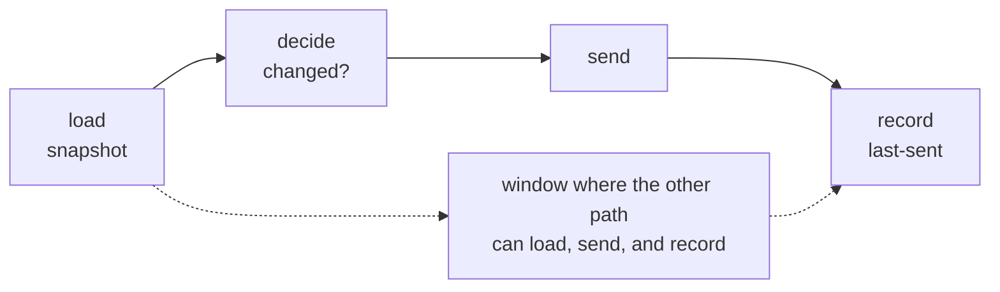
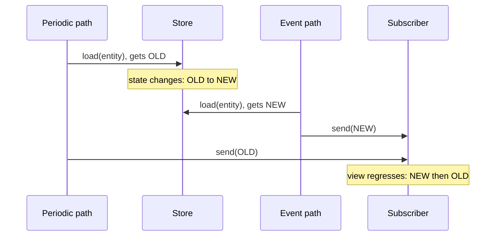
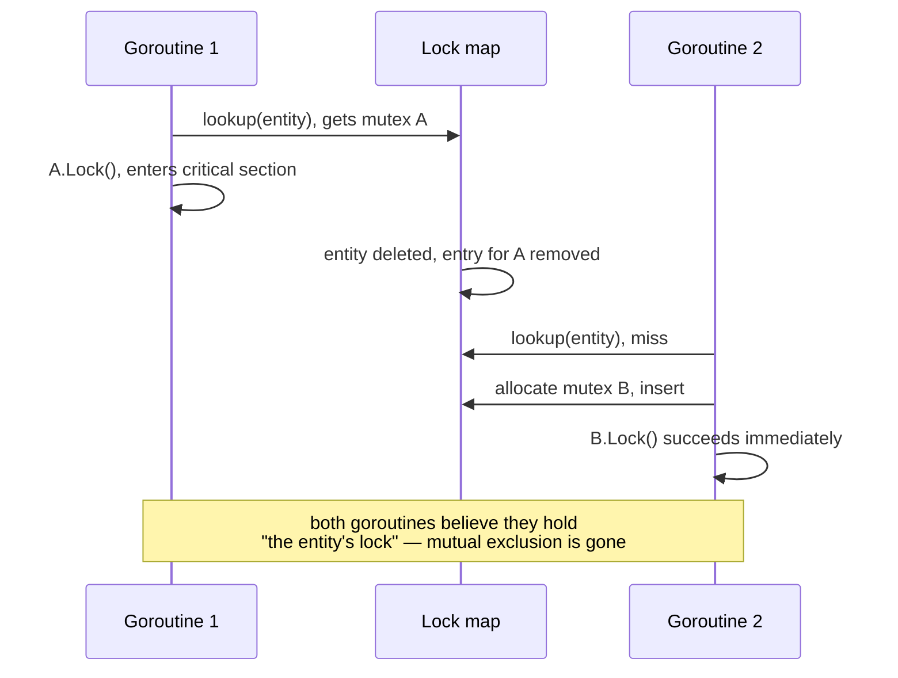
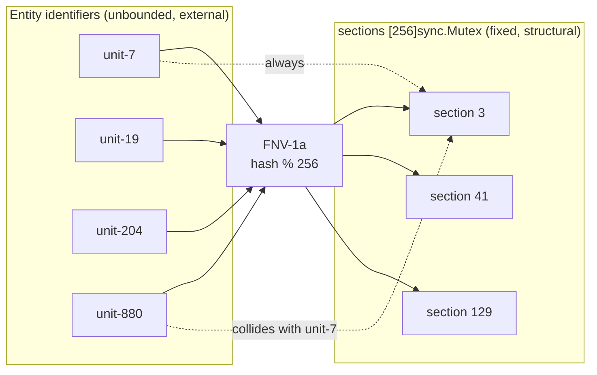
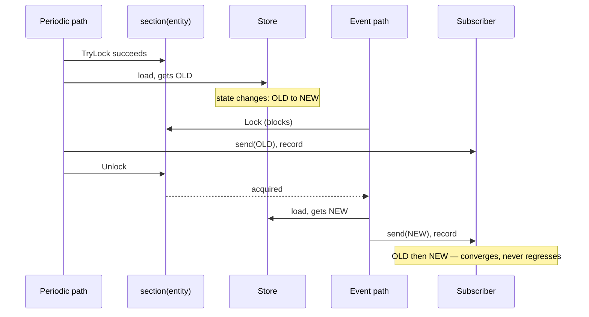
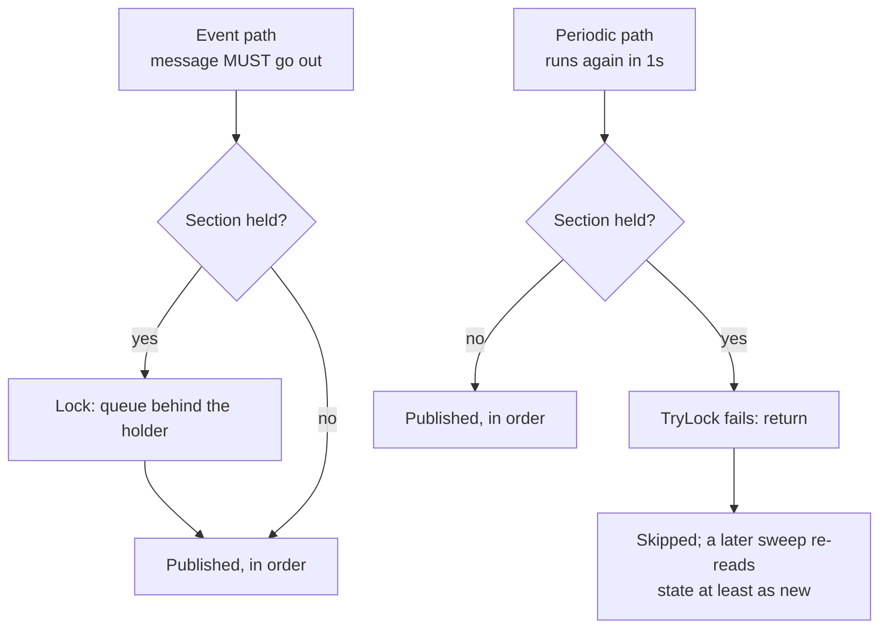
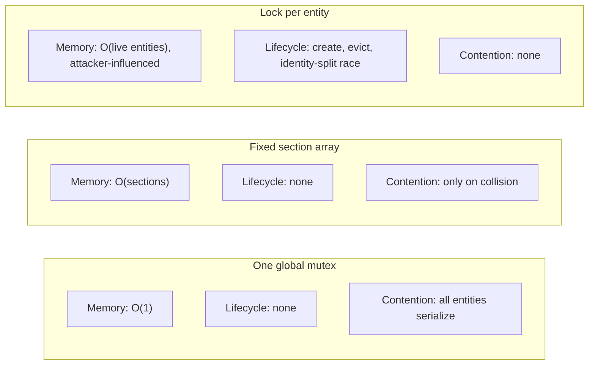

The previous part put a safety contract into a type so the compiler would enforce it. This one is about a different kind of enforcement: an ordering invariant that no type can express, held instead by a data structure so small it has no failure modes of its own.

The problem is a check-then-act race between two paths that publish the same entity. The textbook fix — a lock per entity — costs more in lifecycle management than the race costs in correctness. There is a cheaper shape.

<!--more-->

---

## TL;DR

Two independent code paths both read an entity's state and then act on it. Interleaved, they can publish a **stale result after a fresh one**, and the subscriber's view regresses.

A `map[EntityID]*sync.Mutex` fixes it and hands you three new problems: create-on-first-use, evict-on-delete, and an eviction race that splits the lock's identity.

A **fixed array of striped mutexes** indexed by a hash of the identifier fixes it with no lifecycle at all. Add `TryLock` on the deferrable path and the periodic sweep never queues behind the event path.

To be precise up front: the pattern does not eliminate locking — a section *is* a mutex. It eliminates the **per-entity lock object and its lifecycle**.

---

## The Race

A service publishes an entity's status to a subscriber. Two paths produce the same message:

- an **event path**, which publishes immediately after a state change;
- a **periodic path**, which sweeps all entities once a second and publishes anything that changed.

Each path performs the same non-atomic sequence: load a snapshot, decide, send, record what was sent. Nothing stops the world between *load* and *send*.



So this interleaving is possible:



Two things break. The subscriber's view **regresses**: it saw NEW, then the straggler overwrote it with OLD. And the *last-sent* ledger each path updates after its send (omitted above) races the same way: depending on how the two record steps interleave, the ledger can hold NEW while the subscriber last received OLD — so every later "did it change?" decision is made against a value that does not match what the subscriber displays.

This is a classic check-then-act race. Each path is individually correct; the interleaving is not.

---

## Why Not a Lock Per Entity?

A `map[EntityID]*sync.Mutex` guarded by its own mutex works. Consider what it obligates you to:

- **Creation.** First use of an entity must allocate its lock under the map lock — double-checked, or the map lock serializes everything.
- **Eviction.** When the entity is deleted you must remove the lock, or the map grows without bound. If the identifier space is fed by external input, an outsider chooses your memory growth.
- **The eviction race.** Deleting the map entry does not free a mutex other goroutines still reference — it *splits the lock's identity*.

That third one is the expensive one, and it is worth drawing:



There is a cheap way out of that specific race — hold the registry mutex while acquiring the entity mutex and while removing its entry, so no goroutine can be holding a lock that has already been replaced. It is correct, and it is also exactly the global serialization a per-entity lock existed to avoid: every unrelated entity now queues behind the registry. Keeping the fine-grained property *and* correct eviction is what needs reference counting or an epoch scheme — real complexity for a lock you only wanted for a microsecond.

---

## The Section Pattern

Replace the registry with a fixed array. Hash the entity's identifier to pick a slot.



```go
// sectionCount is a compile-time constant baked into the array's type;
// memory is bounded structurally, no matter how many entities exist or who
// invents their identifiers.
const sectionCount = 256

// An Emitter is constructed once and used by pointer, never copied: the
// embedded mutexes make a copy after first use invalid (go vet's copylocks
// analyzer flags it).
type Emitter struct {
    sections [sectionCount]sync.Mutex
    // ... store, transport, last-sent ledger ...
}

// section returns the entity's serialized section. The array is fixed, so an
// unseen entity already has one and deletion never has a lock slot to drop.
func (e *Emitter) section(id string) *sync.Mutex {
    // FNV-1a inline: runs on every emission, so it allocates neither a
    // hasher nor a byte slice.
    const (
        offsetBasis = uint32(2166136261)
        prime       = uint32(16777619)
    )
    hash := offsetBasis
    for i := 0; i < len(id); i++ {
        hash ^= uint32(id[i])
        hash *= prime
    }
    return &e.sections[hash%sectionCount]
}
```

The hash is FNV-1a — tiny, allocation-free, and **deterministic**: the same identifier always maps to the same section, which is the entire correctness argument.

Go's `hash/maphash` can serve too, but only if the `Emitter` creates one `maphash.Seed` and reuses it for every lookup. Independently created hashers may carry different seeds even within one process, and a per-call hasher could map the same identifier to different sections and silently break the serialization. The inline FNV-1a sidesteps that trap, allocates nothing, and keeps the mapping reproducible in tests.

Both paths then hold the section across the *whole* sequence:

```go
// Event path: must publish, so it waits its turn.
func (e *Emitter) publishOnEvent(ctx context.Context, id string) error {
    sec := e.section(id)
    sec.Lock()
    defer sec.Unlock()
    return e.loadDecideSendRecord(ctx, id)
}

// Periodic path: opportunistic, so it yields instead of queueing.
func (e *Emitter) publishOnSweep(ctx context.Context, id string) {
    sec := e.section(id)
    // Periodic work is deferrable by definition: skip rather than queue
    // behind the holder, and let a later sweep re-read fresh state.
    if !sec.TryLock() {
        return
    }
    defer sec.Unlock()
    _ = e.loadDecideSendRecord(ctx, id)
}
```

With the section held from load to record, the earlier interleaving cannot occur:



The invariant the section buys: **the last send for an entity always carries the last read for that entity**, and the ledger is updated in the same order the sends were issued. A stale message can still be *sent* — the periodic path's `send(OLD)` above — but never *after* a fresher one: momentary staleness that converges, rather than a regression that persists.

Three assumptions make that claim honest, and all three are worth writing into the design record rather than discovering later:

1. Every producer for the entity goes through the same section array **in the same process**.
2. `send` does not return until the message's position in the outbound order is committed.
3. The transport preserves that order to the subscriber.

An asynchronous send or a reordering transport moves the problem beyond the mutex's reach.

### The `Lock` / `TryLock` Asymmetry Is Load-Bearing



The event path carries a message that *must* go out, so it queues. The periodic path is opportunistic by definition — it runs again in a second — so blocking on the section buys nothing a later sweep's fresh read would not: whatever this sweep would have published, a later sweep publishes from state at least as new. `TryLock` turns "queue behind the holder" into "skip; a later sweep re-reads and retries."

The caveat: under sustained contention a given entity's attempt can keep losing, because `TryLock` grants no fairness. The Go documentation famously warns that `TryLock` uses are "often a sign of a deeper problem" — this is one of the legitimate exceptions, because the fallback is not a spin, it is *doing nothing*, which here is correct behavior.

---

## What Collisions Cost

With 256 sections, more than 256 entities guarantees a shared section (pigeonhole) — and chance collisions arrive far sooner than that (the birthday problem). FNV-1a is deterministic and unkeyed, so identifiers chosen by an external party can even be crafted to pile onto one stripe; if the identifier space is adversarial, that concentration belongs in your threat model.

What does a collision cost?

| Axis | Cost of a collision |
| --- | --- |
| **Correctness** | Nothing. Serialization per entity is the requirement; a shared mutex serializes *more* than required, never less. Two colliding entities can never corrupt each other's ordering. |
| **Liveness** | A delay. An event-path publish for A waits while every already-queued holder of that section finishes — each wait is one full critical section, which includes the send. |
| **Determinism** | Which entities collide is fixed by the hash. If a test or an operator invariant depends on *which* publish is skipped under contention, changing the hash function changes the observable schedule. |

The liveness row has a sharp edge worth stating in full, because it is easy to state too optimistically. The critical section includes the send, so **bound the send** with a per-send timeout context — otherwise a single stuck send holds the section forever. But note precisely what that timeout does and does not buy: it bounds the *holder's* time in the section. It does nothing for a caller already parked in `Lock`, because `sync.Mutex.Lock` does not observe context cancellation — a blocked caller cannot be released by cancelling its context, and Go's `Mutex` offers no bounded-acquisition guarantee at all. So the worst case for an event-path publish is not one critical section; it is however many colliding publishes are queued ahead of it, each bounded by the send timeout. Size the array so that number stays near zero.

On the periodic side, the sweep's `TryLock` for A yields when B holds the slot, deferring A's *periodic* refresh to a later tick; with no fairness from `TryLock`, sustained contention can repeat the deferral indefinitely. Acceptable for a keepalive; not acceptable if the sweep is the only path that publishes something.

The determinism row means the hash is part of the behavior, not an implementation detail. Treat it that way in review.



The trade is the one lock striping has always made: bounded memory and zero lifecycle management, paid for with occasional false contention on a shared stripe. Sizing follows the usual rule of thumb — comfortably more sections than expected concurrent holders, and a power of two so the modulo compiles to a mask.

---

## When This Pattern Fits

Use a fixed section array when all of these hold:

1. The critical section is **short and never acquires another section**. That rules out lock-order cycles among the stripes, though not deadlock in general: code holding a section must also never wait on a resource whose owner needs that section — which includes re-entering an emission for a colliding entity. (Guava's `Striped` documents the same discipline: acquiring multiple stripes needs a canonical order; better to never need more than one.)
2. Entities are **independent** — correctness is per-entity ordering, not a cross-entity invariant. A cross-entity transaction needs a different tool.
3. Entity identifiers come and go **without a natural lock-teardown point**, or are influenced by external input — exactly where a lock registry's eviction problem bites hardest.
4. One of the contending paths can afford to **yield** — that is what lets `TryLock` replace queueing and keeps the periodic path from stacking up behind a slow send.

If instead you need cross-entity atomicity, fairness guarantees, or reader-writer semantics, reach for the appropriate heavier tool. Striping is for the narrow, common case of "serialize each key, cheaply, forever."

---

## The Agentic Through-Line

Ask a coding agent to fix the race at the top of this article and you will get a `map[EntityID]*sync.Mutex` behind a `sync.RWMutex`. It is the textbook answer, it is well represented in every corpus, and it is *correct* on the axis the prompt named. It is also the answer that ships three new problems the prompt did not mention.

That is the recurring failure mode of this series stated in one more form. Part 5's bug survived because nobody asked what the failure path cost; part 6's hazard needed a type because a comment could not carry it. Here the gap is different again: the prompt specified a **correctness** requirement and left the **lifecycle** requirement unstated, so the generated design optimized the one axis it could see.

Three things move the outcome:

**Name the axis the obvious answer loses on.** "Serialize per entity, with no per-entity allocation and no teardown path" is a different prompt from "fix this race," and it gets a different design. If the constraint is not in the spec, it is not in the diff.

**State who owns the identifier space.** "Entity identifiers come from inbound messages" is the sentence that makes unbounded map growth a security property rather than a memory nit. An agent will reason about adversarial input correctly once told the input is adversarial, and essentially never before.

**Ask for the rejected alternatives, with their costs.** A design note listing "one global mutex / striped array / lock per entity" against memory, lifecycle, and contention is a review artifact a human can check in a minute. A patch that merely works is not. The comparison figure above took less effort to produce than the eviction-race sequence diagram took to understand — and it is the one that would have prevented the wrong turn.

The blanket rule the documentation states — `TryLock` is "often a sign of a deeper problem" — is exactly the kind of guidance an agent applies literally and a reviewer must be able to override with a reason. Write the reason down: *the fallback is doing nothing, and doing nothing is correct here because the work repeats in one second.* Rules of thumb travel well in training data. The exceptions have to come from you.

> If the constraint is not in the spec, it is not in the diff.

---

## References

- Go standard library, [`sync.Mutex.TryLock`](https://pkg.go.dev/sync#Mutex.TryLock) — including the "sign of a deeper problem" caveat this article argues an exception to.
- Guava [`Striped`](https://guava.dev/releases/snapshot-jre/api/docs/com/google/common/util/concurrent/Striped.html) — the canonical packaged form of lock striping, with the same fixed-stripes / bounded-memory trade-off.
- Baeldung, [Introduction to Lock Striping](https://www.baeldung.com/java-lock-stripping) — a short walkthrough of striping versus one coarse lock.
- Brian Goetz et al., *Java Concurrency in Practice*, §11.4.3 "Lock striping" — the original mainstream treatment ([jcip.net](https://jcip.net/)).
- Wikipedia, [Fowler–Noll–Vo hash function](https://en.wikipedia.org/wiki/Fowler%E2%80%93Noll%E2%80%93Vo_hash_function) — the FNV-1a variant used to index the section array.
- Wikipedia, [Race condition — software](https://en.wikipedia.org/wiki/Race_condition#Software) — background on check-then-act interleavings.
- Wikipedia, [Pigeonhole principle](https://en.wikipedia.org/wiki/Pigeonhole_principle) and [Birthday problem](https://en.wikipedia.org/wiki/Birthday_problem) — why collisions arrive well before the stripe count.

*Code in this article is a sanitized rendering of a production implementation: identifiers and package names have been genericized and unrelated detail elided. The mechanism and the failure analysis are faithful to the original.*
