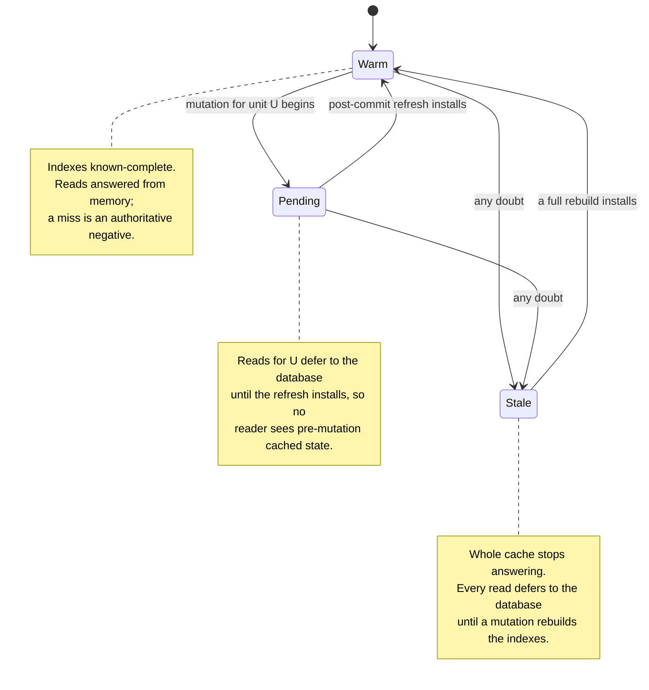
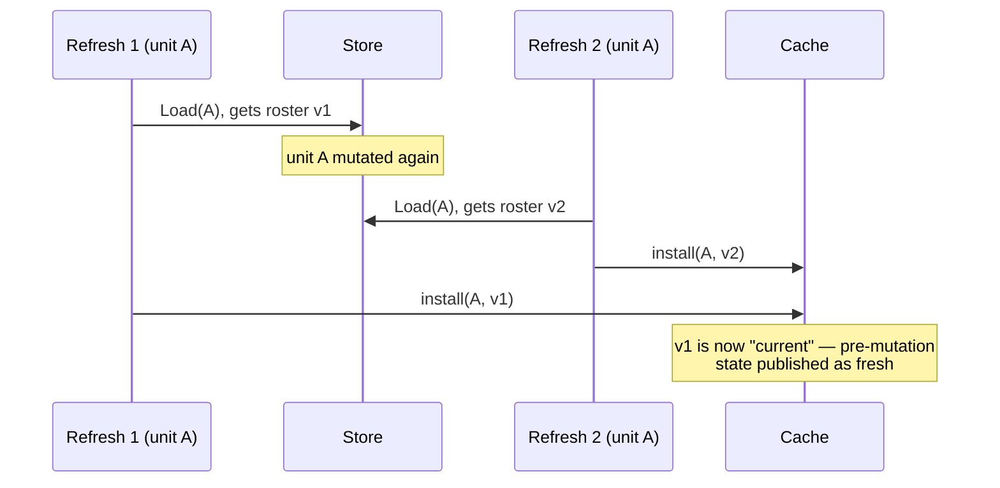
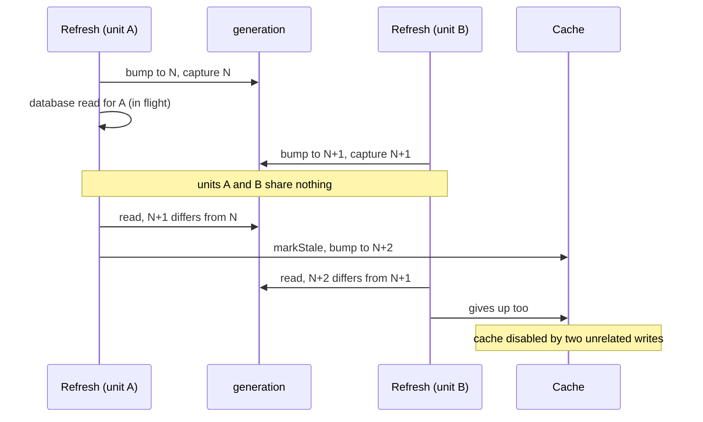
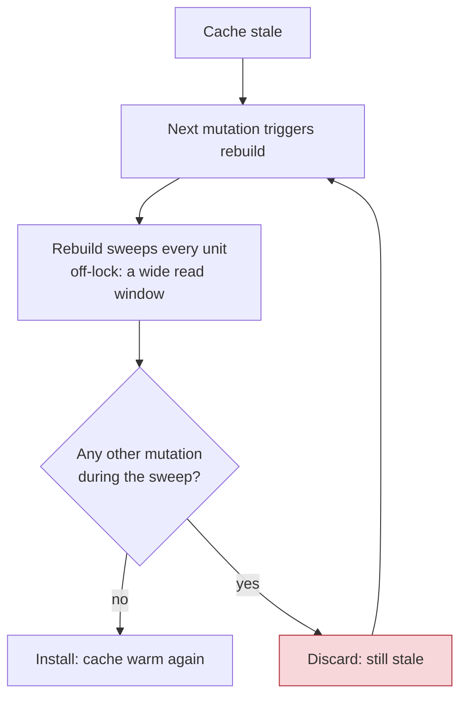
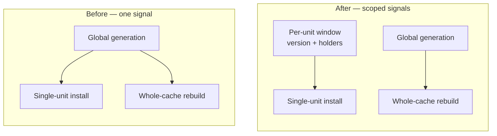
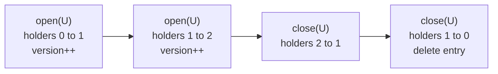
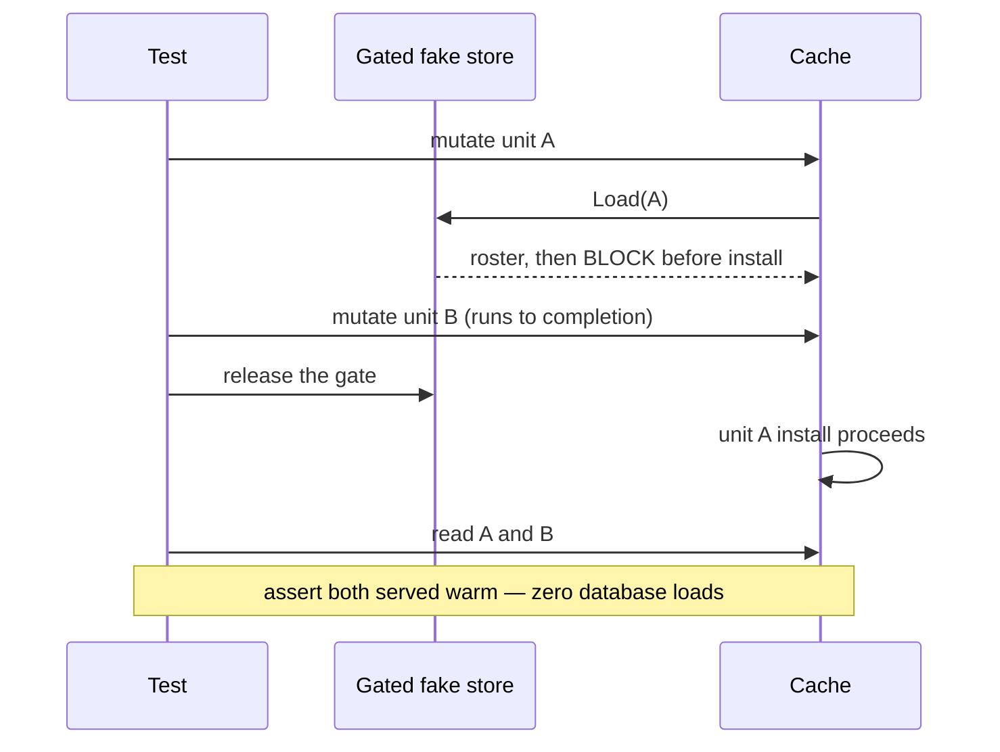

A cache can be perfectly correct and still be broken. Every answer it returns
is right; every access is properly locked; the race detector is silent; the
ordering tests pass; mutation testing leaves no survivors. And yet the database
is serving every single read, because the cache decided — on the strength of a
signal that meant nothing — that it could no longer be trusted.

The bug was not in what the guard checked. It was in *how much* the guard
watched.

<!--more-->

---

## The short version

A write-through cache protected its refresh path with a **generation counter**:
bump it when a refresh starts, and refuse to install a result if the counter
moved during the read. That correctly prevents an older read from overwriting a
newer one.

The invariant is **per unit**. The counter was **global**. So a write to unit B
invalidated an in-flight refresh for unit A, and — in a fail-safe design where
doubt means "stop trusting the cache" — one overlap between two unrelated writes
disabled the entire cache.

Recovery required a quiet window that a busy system never provides. Nothing
logged it. The only symptom was the thing the cache existed to remove: a
database read on every tick, silently restored, potentially for the rest of an
operating session.

The fix is one sentence: **scope the guard to what its protected result actually
covers.**

---

## The setup

The system is a long-lived coordination service brokering commands between
operator applications and a fleet of vehicles grouped into units. A periodic
command path — roughly once per second, per active unit — needs the unit's
current membership roster.

Originally each tick read that roster from the database. To take the database
off the hot path, we added a write-through, write-invalidated in-memory cache: a
decorator over the storage port that serves roster reads from an in-memory
snapshot and re-indexes a unit after each committed mutation.

The cache has three trust states worth naming.



Two details about **Pending** matter. The mutation wrapper marks the unit
pending *before* issuing the storage write, and clears it only *after* the
refresh completes — so there is no post-commit window in which a reader still
gets the old cached roster. And this marker is entirely separate from the
refresh-ordering machinery below; conflating the two is easy and wrong.

Because these reads feed a safety-critical command fan-out, the design is
deliberately conservative: **any doubt degrades to the database, never to a
possibly-wrong in-memory answer.** That conservatism is correct. The bug was in
how cheaply the cache could be pushed into doubt.

---

## The refresh race the design had to handle

Two lifecycle facts underpin everything that follows, and both are assumptions
about the write path and the store rather than properties the cache enforces:

1. **Exactly one refresh runs per committed mutation**, and it starts only after
   the commit is acknowledged. So "a refresh started" and "a mutation committed"
   are interchangeable events.
2. **The refresh reads from the same store that acknowledged the commit**
   (read-after-write consistency). A refresh triggered by a commit always
   observes that commit or something newer.

A refresh works like this. All names here are illustrative, not the production
ones.

```go
func (c *Cache) refresh(ctx context.Context, unit UnitID) {
    snapshot, err := c.store.Load(ctx, unit) // off-lock database read
    if err != nil {
        c.markStale()
        return
    }
    c.mu.Lock()
    defer c.mu.Unlock()
    c.install(unit, snapshot)
}
```

The database read happens **outside** the lock — deliberately, because holding a
cache-wide mutex across a network round trip would defeat the point of the cache.
The consequence is that two refreshes for the same unit can interleave.



Installing refresh 1's result at that point publishes pre-mutation state as
current. The race detector cannot see this: every access is properly locked. The
writes are synchronized; the **ordering** is wrong.

---

## The original defense: a generation counter

```go
func (c *Cache) refresh(ctx context.Context, unit UnitID) {
    c.mu.Lock()
    c.generation++             // one counter for the whole cache
    captured := c.generation
    c.mu.Unlock()

    snapshot, err := c.store.Load(ctx, unit)
    if err != nil {
        c.markStale()
        return
    }
    c.mu.Lock()
    defer c.mu.Unlock()
    if c.generation != captured {
        // Another refresh started during our read - one refresh per commit,
        // so something committed. Distrust everything.
        c.markStaleLocked() // sets stale AND bumps the counter again
        return
    }
    c.install(unit, snapshot)
}
```

Every mutation bumps the counter at refresh start, and marking the cache stale
bumps it once more — that second bump matters shortly. An install goes through
only if the counter has not moved since capture.

This correctly prevents the older-install-wins race. Every ordering test passed.
Mutation testing of the guard left no non-equivalent survivors. The cache
shipped.

---

## The bug: a global guard for a per-unit invariant

The invariant the counter protects is *per unit*:

> Do not install a read that a newer commit **for the same unit** has outdated.

The counter is *global*: any mutation on any unit bumps it. The guard therefore
answers a strictly larger question than the one being asked — and answers it in
the direction of maximum distrust.

Interleave two unrelated units:



Step by step:

1. Unit A is mutated. Its refresh captures generation N and starts its database
   read.
2. Unit B is mutated. Its refresh bumps the generation to N+1.
3. Unit A's install runs, sees N+1 differs from N, and concludes — wrongly — that
   its read is outdated. It marks the **entire cache** stale.
4. Unit B's install hits the same tripwire, because the stale-marking bumped the
   counter again, and also gives up.

One overlap between two unrelated writes, and the cache has disabled itself.

From here it gets worse in two compounding ways.

### Recovery needs quiet

A stale cache is rebuilt only by the next mutation — and that rebuild is guarded
by the same global counter. So the rebuild is *also* discarded if the counter
moves between its capture and its install, which happens whenever any other
mutation's refresh starts during the rebuild's read sweep.



The rebuild's read window is the *widest* in the system — it reads every unit —
so it is the operation most likely to be interrupted. The cache recovers only
when a rebuild's entire read sweep happens to overlap no other mutation. On a
busy fleet, that window may not arrive.

### Nothing reports it

Every answer the degraded cache produces is still **correct** — it just comes
from the database. No error is returned. The cache emits no log line and owns no
metric that would move. The only signal is indirect, in the database's own load
graph.

So the symptom is precisely the thing the cache existed to remove: a database
read on every periodic tick, silently restored, potentially for the rest of an
operating session.

A reviewer caught it by reasoning about scope, then reproduced it: after two
overlapping ownership changes on different units, one hundred reads that should
have been warm produced one hundred database loads.

---

## Why the test suite was blind to it

The suite had strong coverage of this exact code path. None of it could see this
failure.

| Test category | What it asserted | Why it passed anyway |
| --- | --- | --- |
| Correctness assertions | Reads return the right roster | A stale cache defers to the database, and the database has the right answer |
| Ordering tests | An older same-unit read never becomes current | They mutated **one unit twice**; cross-unit overlap was never a scenario |
| Read-counting tests | A warm cache answers without touching the store | They counted reads **around single mutations**, never straddling an overlap of two |

The second row is the interesting one. The scenarios were chosen from the mental
model "the counter detects concurrent commits" — without ever asking *whose*
commits it should detect. The tests were faithful to the design's intent, and
the intent was where the bug lived.

The general lesson: when a component's value is a **performance property**
("serves without touching storage"), a regression in that property is invisible
to every assertion about answers. You have to count effects — calls reaching the
dependency — **across** the concurrency scenarios, not just after them.

---

## The fix: scope the guard to what the result covers

The repair splits one counter into two guards, each scoped to what its protected
result actually covers.



- A **per-unit window** guards single-unit refresh installs. Only a newer commit
  *for the same unit* outdates an in-flight read.
- The **global counter** remains, but now guards only whole-cache rebuilds — a
  rebuild reads every unit, so a commit anywhere genuinely can outdate it.

```go
// window orders one unit's in-flight refreshes: version decides which install
// is newest, holders counts them so the entry is dropped at zero.
type window struct {
    version uint64
    holders int
}

func (c *Cache) refresh(ctx context.Context, unit UnitID) {
    c.mu.Lock()
    c.generation++                    // still bumped: rebuilds must see it
    rebuildGen := c.generation
    captured := c.open(unit)          // per-unit version for THIS refresh
    stale := c.stale
    c.mu.Unlock()
    defer c.close(unit)

    if stale {
        // One unit cannot restore trust in the whole cache: re-read every
        // unit, install only if c.generation still equals rebuildGen.
        c.rebuild(ctx, rebuildGen)
        return
    }

    snapshot, err := c.store.Load(ctx, unit)
    if err != nil {
        c.markStale(ctx, err)
        return
    }
    c.mu.Lock()
    defer c.mu.Unlock()
    if c.windows[unit].version != captured {
        // A newer same-unit refresh owns the install; it will publish fresher
        // state or mark the cache stale itself. Discard silently.
        return
    }
    c.install(unit, snapshot)
}
```

The stale branch is where the retained global counter earns its keep: a rebuild
reads every unit off-lock, so a commit anywhere during that sweep genuinely can
outdate its result, and the rebuild installs only if the global counter is
unchanged since capture. The guard is not weaker — it is *aimed*.

### Three load-bearing details

**A mismatch now discards silently instead of distrusting the cache.**

That is safe precisely *because* the guard is correctly scoped. A mismatch proves
a newer refresh for the same unit exists, and — given the two lifecycle facts
from earlier (one refresh per commit, started post-commit, reading with
read-after-write consistency) — that refresh's read is at least as new as the
discarded one. It will either install fresher state or handle its own failure.

Under the old global guard, silent discard would have been **wrong**: the
discarded install might have been the only one carrying that unit's new state.
The same line of code is correct or incorrect depending entirely on the scope of
the signal above it.

**The window map cannot grow without bound.**

Versions must be monotonic while any refresh for the unit is in flight —
resetting them would re-admit the original race via version reuse. But entries
are reference-counted and deleted when the last holder leaves.



The map's size is bounded by the number of distinct units with a refresh still
**open at that moment**, not by how many units have ever existed.

Mutation testing earned its keep here: the first mutation run *against the fix*
left exactly the cleanup lines surviving — `holders--` and the zero check — which
no behavioral assertion could see. A white-box test now pins the map empty once
mutations resolve.

**Degrading is now an event, not a silence.**

Marking the cache stale checks and flips the state under the cache lock, so the
transition has exactly one owner. It logs a warning once per transition *into*
the stale state, with the cause attached; failures while already stale stay
quiet, so a struggling database cannot turn the log into a flood.

Half of the original incident was not the bug but its invisibility. A cache that
is allowed to fall back must say so.

---

## The regression test

The reproduction is deterministic and takes milliseconds — no soak test, no
stress harness.



A gated fake store lets the first refresh perform its read and then blocks it; a
second unit is mutated to completion; the first refresh is released; the test
asserts that subsequent reads of both units are served warm, with **zero**
delegate loads.

On the parent commit it fails, with the delegate read count climbing. On the fix
it passes. The pre-existing same-unit ordering tests still pass, now exercising
the silent-discard path instead of the distrust path.

---

## The agentic through-line

Ask a coding agent to make a refresh path safe against reordering and you will
get a generation counter. It is the textbook answer, it is correct on the axis
the prompt names, and it is what a reviewer expects to see. The counter here was
not a hallucination or a sloppy shortcut — it is the *right pattern*, applied at
the wrong granularity.

That is the recurring shape of this series in one more form. Part 5's bug
survived because nobody asked what the failure path cost. Part 6's hazard needed
a type because a comment could not carry it. Part 7's design lost on a lifecycle
axis that the prompt never named. Here the pattern was right and its **scope**
was never specified — and scope is exactly what a plausible-looking diff hides.

Three things move the outcome:

**State the invariant with its quantifier.** "Do not install a stale read" and
"do not install a read that a newer commit *for the same unit* has outdated" are
different specifications, and only the second one constrains the guard's
granularity. If the quantifier is missing from the spec, it will be missing from
the diff — and a global signal will look like a conservative choice rather than a
bug.

**Ask what the cheapest event is that degrades the system.** In a fail-safe
design the reflex "when in doubt, fall back to the source of truth" is right, but
it converts every false positive into a real cost. An agent will happily generate
the fallback and never audit its trigger. The question that finds this bug is:
*what is the least-significant thing that can push this into its degraded mode,
and how does it get back out?*

**Ask for the performance contract as an assertion, not a comment.** "Serves
without touching storage" is a testable claim: count delegate calls across an
interleaving. Agents write correctness assertions readily because the corpus is
full of them. Effect-counting tests across concurrency scenarios are rare in the
corpus and have to be asked for by name.

The counter's comment read *"another refresh started during our read — something
committed."* Every word of that is true. It simply never asks *whose* commit,
and neither did anyone reviewing it.

---

## Takeaways

1. **Match the scope of a guard to the scope of its invariant.** A per-entity
   invariant checked with a global signal converts unrelated concurrency into
   false conflicts. The failure mode is not corruption but spurious
   self-distrust — which in a fail-safe design means spurious degradation.
2. **Fail-safe designs need degradation budgets.** "When in doubt, fall back to
   the source of truth" is the right reflex, but if doubt is too cheap to
   trigger, the fallback becomes the steady state. Ask what the cheapest event is
   that pushes the system into its degraded mode, and how it gets back out.
3. **Test the performance contract under concurrency, not just the answers.**
   Count calls to the dependency across interleavings. Correct-but-slow is a bug
   that answer-checking tests certify as healthy.
4. **Make degradation observable.** Any component designed to silently do the
   safe-but-expensive thing needs a signal on the transition. Silent resilience
   and silent failure look identical from the outside.
5. **Deterministic interleaving beats stress.** A fake dependency that blocks
   after reading, two mutations, and a read counter pinned this bug in
   milliseconds — and the same harness proved the fix.

---

## References

- Go standard library, [`sync.RWMutex`](https://pkg.go.dev/sync#RWMutex) — the
  lock discipline the refresh path uses around its off-lock read.
- Go, [Data Race Detector](https://go.dev/doc/articles/racedetector) — and why a
  clean race report says nothing about *ordering* correctness.
- Martin Kleppmann, *Designing Data-Intensive Applications*, ch. 5 — read-after-write
  consistency, the store assumption the silent-discard fix leans on
  ([book site](https://dataintensive.net/)).
- Wikipedia, [Cache invalidation](https://en.wikipedia.org/wiki/Cache_invalidation) —
  write-through and write-invalidate strategies.
- Wikipedia, [Time-of-check to time-of-use](https://en.wikipedia.org/wiki/Time-of-check_to_time-of-use) —
  the general shape of capture-then-verify guards.
- Wikipedia, [Reference counting](https://en.wikipedia.org/wiki/Reference_counting) —
  the mechanism bounding the per-unit window map.
- [go-mutesting](https://github.com/zimmski/go-mutesting) — mutation testing for
  Go, which surfaced the surviving cleanup lines in the fix.

*Code in this article is a sanitized rendering of a production implementation:
identifiers and package names have been genericized and unrelated detail elided.
The mechanism and the failure analysis are faithful to the original.*
</content>
</invoke>
