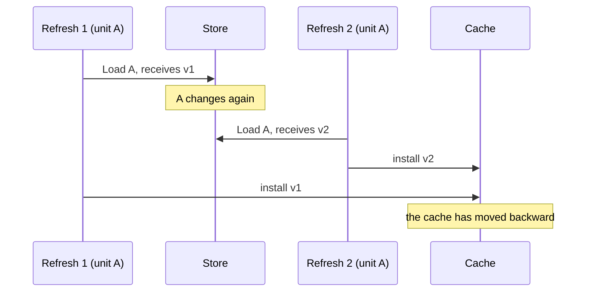

A cache can be correct in every answer and broken in every useful sense. It can
return the proper records, hold its locks with exemplary care, satisfy the race
detector, and pass a formidable suite of tests. Meanwhile, the database is doing
all the work.

This was such a cache. It had been designed to distrust itself whenever an
in-flight refresh might be obsolete—a prudent rule in a system that helped
coordinate moving vehicles. The trouble was that its test for obsolescence
watched the entire fleet. A change to one unit could make the cache doubt an
unrelated unit and, once doubt entered the system, doubt proved difficult to
dislodge.

The defect was not in the guard's logic. It was in the guard's jurisdiction.

<!--more-->

---

## The short version

The cache refreshed a unit's membership after each committed mutation. Because
the database read happened outside the cache lock, two refreshes for the same
unit could finish out of order. A generation counter prevented an older result
from overwriting a newer one.

So far, so sensible. But the protected invariant was local—*do not install a
result superseded by a newer commit for this unit*—while the counter was global.
A refresh for unit B advanced the counter observed by a refresh for unit A. The
cache treated that harmless overlap as evidence of stale data and disabled
itself wholesale.

The fallback was safe: reads went to the database. It was also silent, expensive,
and liable to persist for hours. The repair was to give single-unit refreshes
per-unit versions and reserve the global counter for the one operation whose
scope was actually global: rebuilding the whole cache.

In other words, the scope of a consistency guard should match the scope of the
result it protects.

---

## A deliberately suspicious cache

The service is a long-lived coordinator between operator applications and a
fleet of vehicles arranged into units. About once a second, for each active
unit, a command path needs the unit's current membership roster. The first
version of the service asked the database every time. Since membership changes
far less often than it is read, an in-memory cache was the natural relief.

The cache was a decorator over the storage interface. It served roster reads
from an indexed snapshot and, after a mutation committed, read the affected
unit back from the database and updated the index. Its policy was conservative
for good reason. If it could not establish that its contents were current, it
would use the database rather than offer a possibly wrong answer.

It had three states:

- **Warm.** The indexes were known to be complete. Reads came from memory, and a
  miss meant the requested membership did not exist.
- **Pending.** A mutation for a particular unit was under way. Reads for that
  unit temporarily went to the database.
- **Stale.** The cache no longer trusted its indexes. Every read went to the
  database until a whole-cache rebuild succeeded.

The pending marker closed an important gap. The mutation wrapper set it before
writing to storage and cleared it only after the post-commit refresh. A reader
could therefore not slip into the interval after a commit but before its cache
update and receive the old roster. Pending state and refresh ordering solved
different problems, though they sat close enough in the code to be easily
confused.

Two assumptions about the surrounding system were also essential:

1. Each committed mutation started exactly one refresh, and only after the
   database acknowledged the commit.
2. That refresh read from the same store with read-after-write consistency, so
   it observed its own commit or something newer.

These were not guarantees manufactured by the cache. They were promises made by
the write path and the store, and the cache's proof depended on them.

---

## The race it was built to prevent

The expensive read happened outside the mutex:

```go
func (c *Cache) refresh(ctx context.Context, unit UnitID) {
    snapshot, err := c.store.Load(ctx, unit) // database read, off-lock
    if err != nil {
        c.markStale(ctx, err)
        return
    }

    c.mu.Lock()
    defer c.mu.Unlock()
    c.install(unit, snapshot)
}
```

Holding a cache-wide lock during a network round trip would have serialized
unrelated work and made a sluggish database everybody's problem. The off-lock
read was therefore intentional. It also permitted two refreshes for the same
unit to cross:



Every memory access in this sequence can be synchronized perfectly. That is why
the race detector has nothing to say about it. The problem is not simultaneous
access; it is the semantic order of two valid results.

The original defense was a generation counter:

```go
func (c *Cache) refresh(ctx context.Context, unit UnitID) {
    c.mu.Lock()
    c.generation++
    captured := c.generation
    c.mu.Unlock()

    snapshot, err := c.store.Load(ctx, unit)
    if err != nil {
        c.markStale(ctx, err)
        return
    }

    c.mu.Lock()
    defer c.mu.Unlock()
    if c.generation != captured {
        c.markStaleLocked() // also advances generation
        return
    }
    c.install(unit, snapshot)
}
```

Each post-commit refresh advanced the counter and remembered its value. If the
counter changed during the read, another commit must have occurred; the result
was suspect and could not be installed. Marking the cache stale advanced the
counter again, invalidating other work already in flight.

For two changes to the same unit, this did exactly what was wanted. It prevented
the older refresh from becoming authoritative. The ordering tests passed. The
mutation tests passed. The cache shipped bearing the sort of comment that can
make a broad claim feel precise: “Another refresh started during our read—so
something committed.” Every word was true. The missing word was *where*.

---

## When unrelated work looks dangerous

The invariant was narrower than the mechanism enforcing it:

> Do not install a read that a newer commit **for the same unit** has made old.

The generation counter knew nothing of units. It could report only that
*something, somewhere* had changed. Consider two unrelated mutations:

```mermaid
sequenceDiagram
    participant A as Refresh for A
    participant G as Global generation
    participant B as Refresh for B
    participant C as Cache

    A->>G: advance to N; capture N
    A->>A: read A from the database
    B->>G: advance to N+1; capture N+1
    A->>G: compare N with N+1
    A->>C: mark the cache stale; advance to N+2
    B->>G: compare N+1 with N+2
    B->>C: abandon its install, too
```

The refresh for A saw that the counter had advanced and concluded that its own
snapshot might be old. Yet the intervening commit concerned B; it could not
possibly have altered A's roster. A then marked the entire cache stale and
advanced the counter once more. B, which might otherwise have completed
normally, found itself invalidated in turn. Two independent writes had formed a
small machine for manufacturing distrust.

That was already enough to turn off the cache. The recovery policy made the
condition sticky. A stale cache could be restored only by the next mutation,
which triggered a rebuild of every unit. That rebuild read the full data set
outside the lock and used the same global generation check before installing
it. In this case the global check was appropriate: because the result covered
all units, a commit anywhere really could make it incomplete.

But a full sweep also created the widest vulnerable interval in the system. If
any other mutation began a refresh before the sweep finished, the rebuild was
discarded. On a busy deployment, recovery required a quiet interval that the
deployment had little reason to provide. The mechanism intended for exceptional
failure could become the cache's ordinary mode of life.

Nothing obvious broke. The degraded cache continued returning correct rosters,
now directly from the database. It raised no error, wrote no log entry, and
owned no metric that changed. The symptom was the very expense the cache had
been introduced to eliminate: one database read per periodic tick, per active
unit, perhaps for the remainder of an operating session.

A reviewer found the defect by asking what the generation represented, then
reproduced it. After overlapping ownership changes on two different units, one
hundred reads that ought to have been served from memory produced one hundred
database loads.

---

## Why good tests missed it

The test suite was not flimsy. It simply asked questions to which the broken
cache had excellent answers.

Correctness tests asserted that a roster read returned the right value. The
fallback database contained the right value, so these tests could not
distinguish a healthy cache from a disabled one. Same-unit ordering tests forced
two refreshes to cross and proved that the older result was never installed.
They confirmed the property the generation counter really did enforce. Even
the read-counting tests considered only isolated mutations; none spanned an
overlap between different units.

This is a recurring trap in caches, queues, circuit breakers, and other
performance machinery. Their functional contract describes *what* comes back.
Their reason for existing describes *how much work* comes back with it. A test
suite that checks only values can certify a component that has quietly ceased
to provide any benefit.

The missing assertion was an effect count under a controlled interleaving:
after unrelated mutations overlap, warm reads must cause zero calls to the
backing store.

---

## Giving each guard the right territory

The fix did not abolish the global counter. It divided responsibility:

- A **per-unit version window** now orders refreshes for a single unit. Only a
  newer refresh for that same unit can disqualify an install.
- The **global generation** now guards only whole-cache rebuilds. Since a
  rebuild covers every unit, any concurrent commit is relevant to it.

The simplified shape is this:

```go
type window struct {
    version uint64
    holders int
}

func (c *Cache) refresh(ctx context.Context, unit UnitID) {
    c.mu.Lock()
    c.generation++                  // whole-cache rebuild guard
    rebuildGen := c.generation
    captured := c.open(unit)        // this unit's version
    stale := c.stale
    c.mu.Unlock()
    defer c.close(unit)

    if stale {
        c.rebuild(ctx, rebuildGen)
        return
    }

    snapshot, err := c.store.Load(ctx, unit)
    if err != nil {
        c.markStale(ctx, err)
        return
    }

    c.mu.Lock()
    defer c.mu.Unlock()
    if c.windows[unit].version != captured {
        return // a newer refresh for this unit owns the install
    }
    c.install(unit, snapshot)
}
```

The distinction changes what a mismatch means. Under the old scheme, a mismatch
said only that some refresh existed. Silently discarding A's result would have
been unsafe, because the other refresh might belong to B; nobody else would
then install A's newly committed state. Under the new scheme, a mismatch proves
that a newer refresh for A exists. Given the earlier lifecycle assumptions, its
read includes the later commit or something newer. It can install the fresher
state—or, if its read fails, take responsibility for degrading the cache.

This is the quiet strength of a properly scoped guard: it permits less drama.
A routine ordering conflict can be discarded without declaring a system-wide
emergency.

Two details keep the repair honest.

First, the per-unit versions cannot be reset while refreshes remain in flight.
Reusing a version too early could allow an old refresh to appear current again.
Each window therefore counts its holders, and its version increases monotonically
for as long as any holder exists. When the last refresh closes, the entry is
deleted. The map is bounded by the number of units being refreshed concurrently,
not by the number of units the service has encountered since startup. Mutation
testing found an otherwise invisible weakness here: decrementing the holder
count and deleting the zero-count entry needed a direct white-box assertion.

Second, becoming stale is now an observable transition. The state change occurs
under the cache lock and emits one warning, with its cause, when the cache first
moves from trusted to stale. Further failures while it remains stale do not
repeat the warning. This produces a signal without allowing a troubled database
to produce a corresponding storm of logs.

---

## A deterministic proof

Concurrency bugs often acquire an undeserved mystique because their tests are
left to chance. This one needed no long-running stress test. A gated fake store
made the relevant order explicit:

1. Mutate unit A and allow its refresh to finish reading, but block it before
   installation.
2. Mutate unit B and let its refresh complete.
3. Release A.
4. Read both units and assert that neither read reaches the database.

On the original implementation, A observed B's generation change, marked the
cache stale, and the final reads reached the store. On the repaired
implementation, A's per-unit version was unchanged, both snapshots installed,
and the delegate read count remained zero. Existing same-unit ordering tests
continued to pass, now through the deliberate silent-discard path.

The test captures both halves of the contract: the returned rosters must be
correct, and a trusted cache must serve them without consulting storage. It also
turns an unlucky production interleaving into four reliable steps that finish
in milliseconds.

---

## The engineering lesson

A generation counter is a standard answer to out-of-order asynchronous work.
That was part of the danger. Familiar mechanisms arrive carrying a presumption
of correctness, and code-generating agents are especially good at producing the
recognizable pattern requested of them. The counter here was not invented badly.
It was applied too broadly.

Specifications often say, “Do not install stale data.” The sentence sounds
complete, but its quantifier is missing. Stale relative to which mutation? For
which entity? Across what interval? “Do not install a read superseded by a newer
commit for the same unit” is less elegant and far more useful: it tells us the
key the guard must carry.

Fail-safe design deserves the same scrutiny. Falling back to the source of truth
is the proper response to uncertainty, but uncertainty is not free merely
because the answer remains correct. A review should ask what is the smallest
event that can trigger degraded mode, how expensive that mode is, how recovery
occurs, and whether anyone will notice. In this case, the smallest event was an
unrelated write, the expense was every hot-path database read, recovery required
quiet, and nobody was told.

The cache was conscientious to a fault. Once taught to distinguish its own
affairs from everybody else's, it became both less suspicious and more reliable.

---

## Takeaways

1. **Match a guard's scope to its invariant.** Per-entity results need
   per-entity ordering; global snapshots need global ordering.
2. **Write the quantifier into the specification.** “For the same unit” can be
   the difference between a safety mechanism and a false-conflict generator.
3. **Test the performance contract under concurrency.** Assert dependency call
   counts as well as returned values, using deterministic interleavings.
4. **Budget and observe degradation.** A safe fallback can still be a serious
   failure if it is cheap to enter, hard to leave, and invisible in operation.
5. **Use broad signals only for broad results.** The global generation counter
   was not inherently wrong; the single-unit refresh was simply beneath its
   jurisdiction.

*The code in this article is a sanitized rendering of a production
implementation. Identifiers and unrelated details have been changed; the
concurrency mechanism and failure analysis are preserved.*
